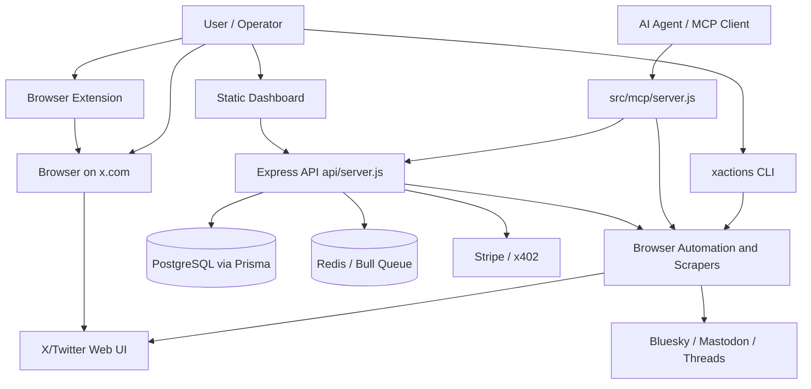

# XActions Brownfield Architecture

Tài liệu này ghi lại kiến trúc hiện trạng của XActions để các agent phát triển tiếp có cùng bản đồ hệ thống, ranh giới module, quyết định kỹ thuật và nguyên tắc thay đổi. Đây là brownfield architecture dựa trên repo hiện tại, không phải thiết kế greenfield.

## 1. Tóm Tắt Hệ Thống

XActions là toolkit tự động hóa X/Twitter không phụ thuộc Twitter API trả phí. Sản phẩm hiện gồm nhiều bề mặt sử dụng chung năng lực scraping, browser automation và workflow:

- Browser scripts chạy trực tiếp trong DevTools trên `x.com`.
- CLI `xactions` cho terminal automation và export dữ liệu.
- MCP server `xactions-mcp` để AI agents gọi tool X/Twitter.
- Express API + dashboard static HTML cho web/self-hosted SaaS surface.
- Browser extension Manifest V3 cho thao tác không cần paste console script.
- Scraper adapters cho Twitter, Bluesky, Mastodon và Threads.
- Plugin system mở rộng scrapers, MCP tools và API routes.
- Prisma/PostgreSQL lưu users, operations, payments, snapshots, schedules và licenses.
- Redis/Bull dùng cho background jobs khi có queue worker.

Kiến trúc ưu tiên công nghệ đơn giản: Node.js ESM, Express, static frontend, Puppeteer, Prisma, Socket.IO và Commander. Rủi ro chính không nằm ở framework mà ở độ biến động của DOM X/Twitter, session cookie handling, rate limits, headless browser stability và việc nhiều entrypoint đang cùng chạm vào cùng năng lực automation.

## 2. Nguồn Sự Thật Brownfield

Các nguồn đã đọc để lập tài liệu:

- `AGENTS.md`: hướng dẫn agent, project map, selector/rate-limit rules.
- `README.md`: positioning, surfaces, version 3.1.0 feature set.
- `package.json`: exports, bin entries, scripts, dependencies.
- `docs/architecture.md`: architecture hiện có của repo.
- `api/server.js`: Express composition root, middleware, route mounts, dashboard serving.
- `src/cli/index.js`: CLI entrypoint, config storage, scraper usage.
- `src/mcp/server.js`: MCP tool definitions, local/remote modes, plugin tools.
- `prisma/schema.prisma`: persistence model.

Không tìm thấy PRD chuẩn trong `_bmad-output/planning-artifacts`. Vì vậy tài liệu này ghi rõ kiến trúc as-built và các quyết định để bảo toàn hệ thống khi tiếp tục phát triển.

## 3. Context Diagram

## 4. Runtime Surfaces

| Surface | Entrypoint | Primary responsibility | Notes |
|---|---|---|---|
| Browser scripts | `src/*.js`, `src/automation/*.js` | Direct DOM automation on `x.com` | Must use stable `data-testid` selectors and 1-3s delays. `src/automation/core.js` is prerequisite for modular automation scripts. |
| CLI | `src/cli/index.js` | Terminal workflows, profile/follower scraping, exports | Stores local config in `~/.xactions/config.json`; uses scraper module directly. |
| MCP | `src/mcp/server.js` | AI-agent tool surface | Supports local Puppeteer mode and optional remote API mode. Plugin tools are appended during startup. |
| API | `api/server.js` | Web API, dashboard backend, auth, jobs, billing, discovery | Composition root for middleware, routes, Socket.IO, plugin routes, licensing and scheduler. |
| Dashboard | `dashboard/*.html` | Static web UI and docs pages | Served directly by Express. No SPA framework. |
| Extension | `extension/` | Browser-side control surface | Should reuse browser automation patterns, not create a separate selector strategy. |
| Node library | `src/index.js`, package exports | Programmatic access to scrapers, streaming, analytics, plugins, spaces | Public API must remain semver-conscious. |

## 5. Codebase Boundaries

### `api/`

Express backend. `api/server.js` owns global middleware, security headers, rate limits, static serving, route mounting, plugin route mounting, Socket.IO initialization, licensing initialization and scheduler startup.

Rules for future changes:

- Route files handle HTTP validation and response shape.
- Service files under `api/services/` hold business logic and external/browser work.
- Resource-heavy routes must stay behind explicit rate limits or queue jobs.
- Stripe webhook raw body handling must stay before JSON parsing for `/webhooks/stripe`.
- `helmet` CSP must be updated deliberately when dashboard assets or external clients change.

### `src/scrapers/`

Reusable scraping layer. Twitter and Threads rely on browser automation; Bluesky and Mastodon use official/HTTP protocol surfaces where available. Adapters normalize output across platforms.

Rules:

- Keep platform-specific quirks inside platform adapter folders.
- Return normalized data structures to CLI/MCP/API callers.
- Do not let CLI-only formatting leak into scraper results.

### `src/automation/`

Browser console automation framework. Scripts run inside the X/Twitter page context, not Node.js. State persistence uses `sessionStorage` and is lost when the tab closes.

Rules:

- Paste/load `core.js` before scripts that depend on it.
- Prefer `data-testid` selectors documented in `docs/agents/selectors.md`.
- Every action loop must include 1-3 second delays and bounded retries.
- Console output can use emoji per existing browser-script convention.

### `src/mcp/`

AI-agent tool server. It exposes XActions operations through MCP transports and chooses local vs remote execution using environment variables.

Rules:

- Tool schemas are public contracts. Additive fields are safe; renames/removals require migration notes.
- Local mode should use Puppeteer/scrapers directly; remote mode should delegate to configured API.
- Tools that mutate X/Twitter state need explicit parameters and clear error messages.

### `src/cli/`

Commander CLI. It orchestrates scraping, authentication config, output exporters and terminal formatting.

Rules:

- Persist user-local CLI config only under `~/.xactions`.
- Keep output adapters extension-driven: JSON, CSV, XLSX and Google Sheets support should stay in `smartOutput`-style boundaries.
- Avoid duplicating scraper logic in commands.

### `dashboard/`

Static HTML/CSS/JS dashboard and docs pages served by Express. This is intentionally low-build and SEO-friendly.

Rules:

- Keep dashboard API calls aligned with `api/routes/*` response shapes.
- Use shared CSS in `dashboard/css/` before adding page-local styling.
- Security-sensitive pages should rely on API-side authorization, not only client-side guards.

### `extension/`

Browser extension surface. It should call content scripts or shared script logic rather than forking selectors.

Rules:

- Manifest V3 constraints apply: service worker lifecycle, explicit permissions and content-script isolation.
- Treat X DOM selectors as shared architecture assets.

### `skills/`

Agent skill instructions. These are product functionality docs for AI assistants and should map user intents to existing scripts, CLI commands, MCP tools or API endpoints.

Rules:

- Skill docs should point to real code paths and exact commands.
- Do not invent automations that are not implemented.

## 6. Data Architecture

Primary datastore is PostgreSQL through Prisma. The schema currently covers:

- `User`: auth identity, credits, admin state, X/Twitter session fields.
- `Subscription`, `Payment`, `CryptoPayment`, `License`: monetization and licensing.
- `Operation`: long-running action tracking for follow/unfollow and related automations.
- `JobQueue`: persisted job records in addition to Bull/Redis worker runtime.
- `AccountSnapshot`, `FollowerSnapshot`, `FollowerChange`, `UnfollowerSchedule`: monitoring and follower history.

Design implications:

- User-owned data must always be scoped by `userId` before read/write.
- Session cookies and OAuth tokens are high-sensitivity fields; logs and API responses must never echo them.
- Snapshot tables can grow quickly. Any new monitoring workflow needs retention or export policy before default enablement.
- `config`, `result`, `metadata`, `followers` and similar string fields are flexible but weakly typed; new structured behavior should define JSON shape in route/service docs or migrate to typed columns when queries require it.

## 7. Security Architecture

Security controls currently visible in `api/server.js`:

- `helmet` with a custom CSP for static dashboard pages.
- `compression` disabled for auth/session endpoints to reduce token response leakage risk.
- CORS restricted in production to `xactions.app` and optional `FRONTEND_URL`.
- Global API rate limit plus stricter limits for auth, agent control, graph, operations, CRM and analytics.
- Request body size limit of `10kb` for JSON and URL-encoded payloads.
- AI-agent detection middleware before route handling.
- Optional x402 middleware and Stripe webhooks.
- Production startup warns about missing `DATABASE_URL` and `JWT_SECRET` but does not hard-exit.

Required guardrails for future agents:

- Never log `Authorization`, session cookies, X auth tokens, Stripe secrets, JWT secrets or private keys.
- Mutating X/Twitter actions must keep human-readable dry-run/preview options where feasible.
- Browser automation must respect X rate limits and include delays.
- Any API route accepting selectors, URLs, file paths or redirect targets must sanitize and constrain them.
- Public discovery endpoints such as `/openapi.json` and `/.well-known/x402` should remain read-only.

## 8. Integration Architecture

### X/Twitter

Primary integration is browser automation rather than official Twitter API. This avoids API fees but makes DOM selectors and account risk the operational bottleneck.

Decision: keep browser automation as the core strategy, but centralize selector knowledge in docs and shared helper code. Avoid creating new hard-coded selector variants in feature files unless the shared selector set is insufficient.

### Multi-platform social scraping

Bluesky, Mastodon and Threads are exposed through scraper adapters and some MCP/CLI options. The architectural boundary is normalized output, not identical implementation technology.

Decision: each platform keeps its own adapter; callers consume a common shape.

### Payments

Stripe handles subscriptions and billing. x402 micropayment support is optional and only active when configured.

Decision: payment features must degrade cleanly when env vars are absent; local open-source usage must not require payment config.

### Plugins

Plugin initialization happens at API and MCP startup. API plugin routes mount under `/api/plugins/<plugin-name>/...`; MCP plugin tools append to tool registry.

Decision: plugin APIs are extension points and should be treated as untrusted boundaries. Validate plugin-provided route metadata and isolate failures so one plugin cannot crash core startup.

## 9. Operational Architecture

Local development scripts:

- `npm run dev`: `NODE_ENV=development nodemon api/server.js`.
- `npm start`: production API server.
- `npm run cli`: CLI entrypoint.
- `npm run mcp`: MCP server.
- `npm run worker`: Bull queue worker.
- `npm test`: Vitest suite.
- `npm run docker:up`: Docker Compose API stack.

Runtime requirements:

- Node.js `>=18`.
- PostgreSQL when persistence features are enabled.
- Redis when Bull-backed background jobs are enabled.
- Puppeteer-compatible Chromium environment for scraping/automation.
- `X_SESSION_COOKIE` or `XACTIONS_SESSION_COOKIE` where authenticated X automation is required.

Operational constraints:

- CPU can spike during type checking, Vitest and Puppeteer runs. Follow project guidance to kill long-running test/typecheck processes when done.
- Browser scripts are inherently brittle against X DOM changes; selector verification should be part of release checks.
- Dashboard is served by API process, so static serving regressions can break docs/product surface even if API tests pass.

## 10. Key Architecture Decisions

### ADR-001: Browser automation is the primary X/Twitter integration

Status: Accepted.

Reasoning: XActions' product promise is no Twitter API fees and browser/API-key-free operation. Puppeteer and DevTools scripts provide access to UI-level behavior the official API may not expose.

Consequences:

- Selector stability and rate-limit safety are first-class architecture concerns.
- Tests must cover DOM extraction helpers and smoke flows, not only pure service functions.
- Automation code must include delays, bounded retries and clear stop conditions.

### ADR-002: Keep multiple entrypoints, share core automation and scraper logic

Status: Accepted.

Reasoning: CLI, MCP, API, dashboard, extension and browser console serve different user workflows. Removing surfaces would weaken the toolkit, but duplicating logic would create drift.

Consequences:

- Shared logic belongs in `src/scrapers`, `src/automation`, `api/services` or plugins depending on runtime context.
- Entry points should orchestrate, validate and format; they should not reimplement scraping algorithms.

### ADR-003: Static dashboard over frontend framework

Status: Accepted for current brownfield.

Reasoning: Existing dashboard and docs are static HTML/CSS/JS served directly by Express. This keeps deployment simple and SEO pages cheap.

Consequences:

- Complex client state must stay modest or be moved into API-backed workflows.
- Shared CSS and shared client helpers are more important than framework components.
- CSP changes must account for inline scripts already used by static pages.

### ADR-004: Prisma/PostgreSQL is the durable system of record

Status: Accepted.

Reasoning: The schema already models users, operations, payments, schedules and snapshots. Prisma keeps migration and generated client workflow conventional.

Consequences:

- New persisted features should start with schema changes and migrations.
- Flexible string JSON fields are acceptable for low-query metadata; query-heavy fields should be typed.
- All user-owned records require explicit authorization checks.

### ADR-005: Plugin system extends core but must not own core invariants

Status: Accepted with guardrails.

Reasoning: Package exports and startup code support community plugins across scrapers, MCP tools and API routes.

Consequences:

- Core server startup should survive plugin load failures.
- Plugin route/tool contracts need validation.
- Security and rate-limit rules still apply to plugin-provided capabilities.

## 11. Change Guidelines For Future Agents

When adding a new X/Twitter automation feature:

1. Identify the target runtime first: browser script, CLI, MCP, API/dashboard, extension or shared library.
2. Put DOM interaction in shared browser/scraper helpers where possible.
3. Use `data-testid` selectors first and update `docs/agents/selectors.md` if selector knowledge changes.
4. Add 1-3 second delays for repeated X actions.
5. Add tests at the lowest stable layer plus a route/CLI/MCP contract test when the public surface changes.
6. Document the exact script, CLI command, API route or MCP tool in the relevant `skills/*/SKILL.md` if user-facing.

When adding an API feature:

1. Add route validation and authorization at route boundary.
2. Keep business logic in `api/services`.
3. Add rate limiting for expensive or mutating operations.
4. Ensure dashboard pages do not rely on client-only security.
5. Update OpenAPI/discovery docs if the endpoint is part of AI/API surface.

When adding a persisted workflow:

1. Model durable state in Prisma.
2. Keep job execution idempotent where possible.
3. Store progress in `Operation` or a workflow-specific table.
4. Emit Socket.IO updates for dashboard-visible long-running jobs.
5. Define retention for snapshots and logs.

## 12. Known Architecture Risks

| Risk | Impact | Mitigation |
|---|---|---|
| X/Twitter DOM changes | Scripts and Puppeteer scrapers break | Centralize selectors, maintain smoke tests, prefer `data-testid`. |
| Account rate limits or anti-automation enforcement | User accounts may be throttled or restricted | Enforce delays, add dry-run previews, bounded batch sizes, clear user warnings. |
| Logic drift across CLI/MCP/API/browser scripts | Same feature behaves differently per surface | Keep core logic shared; entrypoints only orchestrate. |
| Sensitive token leakage | Session cookies/JWT/OAuth tokens exposed in logs or responses | Redaction, response filtering, never echo secrets, review logging changes. |
| Plugin trust boundary | Plugin can destabilize API/MCP startup | Validate metadata, isolate plugin failures, keep core invariants outside plugins. |
| Static dashboard growth | HTML duplication and client-side security assumptions | Shared CSS/helpers; API-side auth; consider framework only after repeated complexity. |
| Snapshot table growth | Database bloat and slow queries | Add retention, indexes and export/archive strategy for monitoring features. |

## 13. Testing Strategy

Current test runner is Vitest. Recommended coverage shape:

- Unit tests for pure parsing, selector normalization, export formatting, payment config validation and route helpers.
- Service tests for browser automation wrappers using controlled fixtures where possible.
- API tests with Supertest for auth, route validation, rate-limit-sensitive paths and error responses.
- MCP contract tests for tool schema stability and handler dispatch.
- CLI tests for command parsing and output routing.
- Browser smoke checks for core X/Twitter selectors when a real browser context is available.

Do not mock external behavior when the objective is verification of real integration. For brittle browser/X behavior, prefer a smoke test gated by env/session availability plus deterministic unit tests around parser/helper logic.

## 14. Architecture Backlog

- Create a canonical selector module or generated selector manifest consumed by browser scripts, Puppeteer scrapers and extension content scripts.
- Add a route/tool registry test to detect MCP/API drift when new features are added.
- Define retention policy for `FollowerSnapshot`, `AccountSnapshot`, `FollowerChange` and operation logs.
- Document plugin security model and minimum plugin metadata contract.
- Add explicit public API compatibility notes for package exports under `exports`.
- Split very large CLI/MCP files when the third repeated feature cluster emerges, preserving current command/tool contracts.

## 15. Continuation Notes

This file intentionally captures the current brownfield architecture instead of waiting for a missing PRD. If a PRD is later created, update this document by adding a requirements trace section rather than rewriting the as-built system map.

