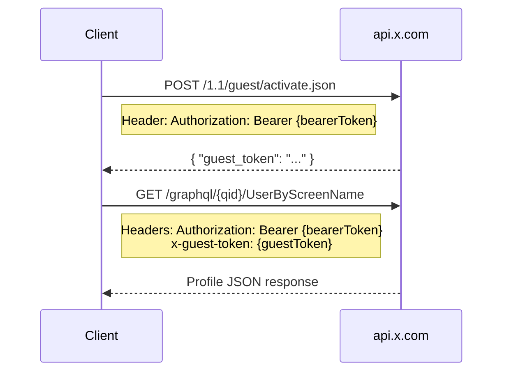
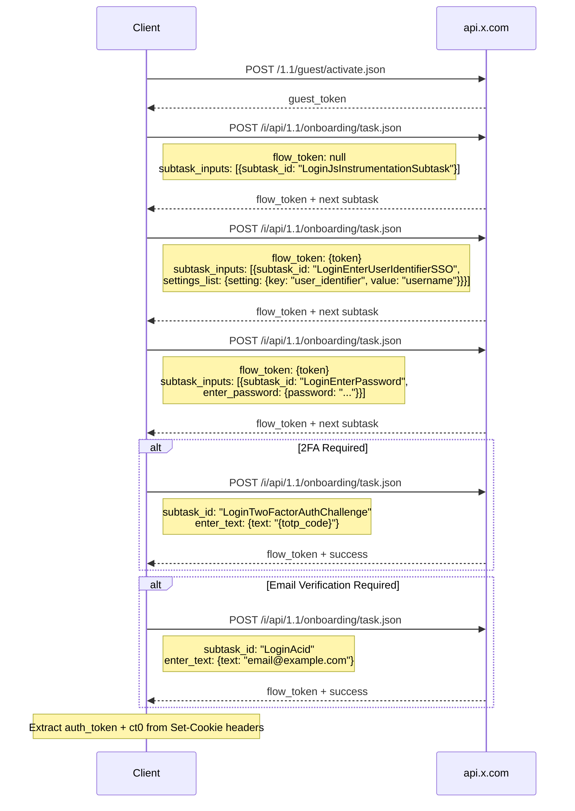
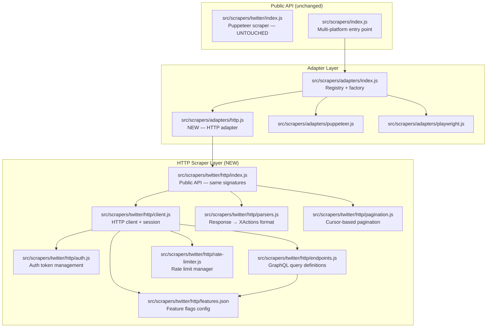
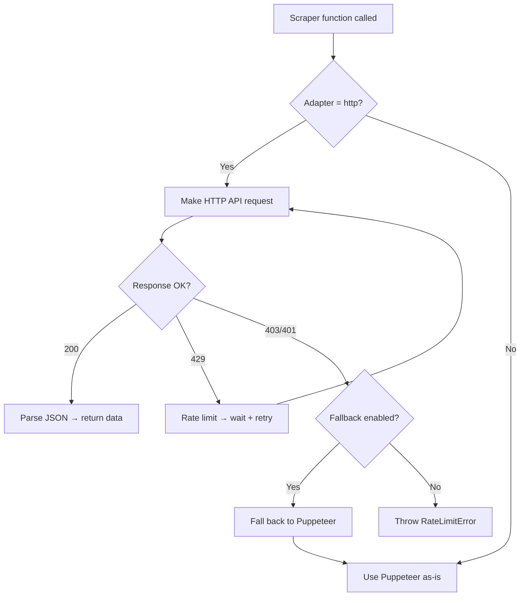
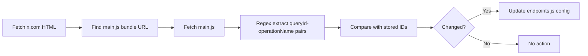

# HTTP-Based Scraper — Architecture & Implementation Plan

> **Track:** 01 — HTTP-Based Scraper  
> **Priority:** P0 — Highest impact improvement  
> **Author:** Research compiled from `the-convocation/twitter-scraper`, `d60/twikit`, `elizaOS/agent-twitter-client`  
> **Date:** 2026-02-26  
> **Status:** Architecture Plan (Ready for Implementation)

---

## Table of Contents

1. [Executive Summary](#1-executive-summary)
2. [GraphQL Endpoint Map](#2-graphql-endpoint-map)
3. [REST API Endpoints](#3-rest-api-endpoints)
4. [Authentication Flows](#4-authentication-flows)
5. [Request Headers](#5-request-headers)
6. [Feature Flags](#6-feature-flags)
7. [Response Parsing](#7-response-parsing)
8. [Cursor-Based Pagination](#8-cursor-based-pagination)
9. [Rate Limits](#9-rate-limits)
10. [Migration Table](#10-migration-table)
11. [Architecture Design](#11-architecture-design)
12. [File Plan](#12-file-plan)
13. [Dependency Analysis](#13-dependency-analysis)
14. [Risk Assessment](#14-risk-assessment)
15. [Implementation Phases](#15-implementation-phases)

---

## 1. Executive Summary

Twitter/X's web client communicates exclusively via internal GraphQL and REST API endpoints at `api.x.com`. Every action performed in the browser — viewing profiles, scrolling timelines, searching tweets — is a plain HTTP request with JSON responses. This means **all 18 of XActions' Puppeteer-based scraper functions can be replaced with direct HTTP calls**, eliminating the need for a headless browser for data retrieval.

### Impact

| Metric | Puppeteer (Current) | HTTP (Proposed) | Improvement |
|--------|---------------------|-----------------|-------------|
| Memory per session | ~200-400 MB | ~5-10 MB | **40-80x less** |
| Startup time | 2-5 seconds | 0 ms | **Instant** |
| Request latency | 1-3s (render + extract) | 200-500ms | **5-10x faster** |
| Concurrent sessions | 2-5 (memory bound) | 50-100+ | **20x more** |
| CI/CD compatibility | Requires Chrome | Pure Node.js | **No binary deps** |
| Data completeness | DOM-visible only | Full API response | **More fields** |

### Approach

- **Non-breaking**: Puppeteer scraper (`src/scrapers/twitter/index.js`) stays untouched
- **Adapter pattern**: New `http` adapter at `src/scrapers/adapters/http.js`
- **Same signatures**: All 18 exported functions keep identical call signatures
- **Graceful fallback**: HTTP failures can optionally fall back to Puppeteer

---

## 2. GraphQL Endpoint Map

All GraphQL endpoints follow this URL pattern:
```
https://api.x.com/graphql/{queryId}/{operationName}
```

Query parameters are URL-encoded JSON objects: `variables`, `features`, and optionally `fieldToggles`.

### 2.1 Read Endpoints (GET)

| Operation | Query ID | Auth Required | Variables |
|-----------|----------|---------------|-----------|
| `UserByScreenName` | `qW5u-DAuXpMEG0zA1F7UGQ` | Bearer only | `screen_name` |
| `UserTweets` | `E3opETHurmVJflFsUBVuUQ` | Bearer + cookie | `userId`, `count`, `cursor?`, `includePromotedContent` |
| `UserTweetsAndReplies` | `ekwzBXpJcRI38DI6gJk_OQ` | Bearer + cookie | `userId`, `count`, `cursor?`, `includePromotedContent` |
| `TweetDetail` | `nBS-WpgA6ZG0CyNHD517JQ` | Bearer + cookie | `focalTweetId`, `withRuxInjections`, `rankingMode` |
| `Likes` (UserLikedTweets) | `fP9tBxwQSlg-sZOqo0K4Pg` | Bearer + cookie | `userId`, `count`, `cursor?`, `includePromotedContent` |
| `ListLatestTweetsTimeline` | `Uv3buKIUElzL3Iuc0L0O5g` | Bearer + cookie | `listId`, `count`, `cursor?` |
| `SearchTimeline` | `ML-n2SfAxx5S_9QMqNejbg` | Bearer + cookie | `rawQuery`, `count`, `querySource`, `product`, `cursor?` |
| `Followers` | `P7m4Qr-rJEB8KUluOenU6A` | Bearer + cookie | `userId`, `count`, `cursor?`, `includePromotedContent` |
| `Following` | `T5wihsMTYHncY7BB4YxHSg` | Bearer + cookie | `userId`, `count`, `cursor?`, `includePromotedContent` |

### 2.2 Write Endpoints (POST)

These endpoints use `POST` with a JSON body and require full authentication (bearer + auth_token cookie + ct0 CSRF):

| Operation | Query ID | Body Fields |
|-----------|----------|-------------|
| `CreateTweet` | `bDE2rBtZb3uyrczSZ_pI9g` | `tweet_text`, `reply?`, `media?`, `quote_tweet_id?` |
| `DeleteTweet` | `VaenaVgh5q5ih7kvyVjgtg` | `tweet_id` |
| `FavoriteTweet` | `lI07N6Otwv1PhnEgXILM7A` | `tweet_id` |
| `UnfavoriteTweet` | `ZYKSe-w7KEslx3JhSIk5LA` | `tweet_id` |
| `CreateRetweet` | `ojPdsZsimiJrUGLR1sjUtA` | `tweet_id` |
| `DeleteRetweet` | `iQtK4dl5hBmXewYZuEOKVw` | `source_tweet_id` |
| `CreateBookmark` | `aoDbu3RHznuiSkQ9aNM67Q` | `tweet_id` |
| `DeleteBookmark` | `Wlmlj2-xIS1cdBbfnhqN-Q` | `tweet_id` |

### 2.3 Relationship Write Endpoints (POST — REST v1.1)

| Endpoint | URL | Body |
|----------|-----|------|
| Follow | `https://api.x.com/1.1/friendships/create.json` | `user_id` |
| Unfollow | `https://api.x.com/1.1/friendships/destroy.json` | `user_id` |
| Block | `https://api.x.com/1.1/blocks/create.json` | `user_id` |
| Unblock | `https://api.x.com/1.1/blocks/destroy.json` | `user_id` |
| Mute | `https://api.x.com/1.1/mutes/users/create.json` | `user_id` |
| Unmute | `https://api.x.com/1.1/mutes/users/destroy.json` | `user_id` |

### 2.4 Detailed Endpoint Specifications

#### UserByScreenName

```
GET https://api.x.com/graphql/qW5u-DAuXpMEG0zA1F7UGQ/UserByScreenName
  ?variables={"screen_name":"elonmusk"}
  &features={...featureFlags}
```

**Variables:**
```json
{
  "screen_name": "elonmusk"
}
```

**Response Path:** `data.user.result`
```json
{
  "data": {
    "user": {
      "result": {
        "__typename": "User",
        "rest_id": "44196397",
        "is_blue_verified": true,
        "legacy": {
          "created_at": "Tue Jun 02 20:12:29 +0000 2009",
          "description": "...",
          "favourites_count": 45231,
          "followers_count": 175000000,
          "friends_count": 823,
          "media_count": 2345,
          "statuses_count": 38000,
          "name": "Elon Musk",
          "screen_name": "elonmusk",
          "profile_image_url_https": "https://pbs.twimg.com/..._normal.jpg",
          "profile_banner_url": "https://pbs.twimg.com/...",
          "location": "...",
          "verified": false,
          "protected": false,
          "can_dm": false,
          "id_str": "44196397"
        }
      }
    }
  }
}
```

#### UserTweets

```
GET https://api.x.com/graphql/E3opETHurmVJflFsUBVuUQ/UserTweets
  ?variables={"userId":"44196397","count":20,"includePromotedContent":false}
  &features={...featureFlags}
```

**Variables:**
```json
{
  "userId": "44196397",
  "count": 20,
  "includePromotedContent": false,
  "cursor": "HBaagLy25a..."  // optional, for pagination
}
```

**Response Path:** `data.user.result.timeline.timeline.instructions[].entries[]`

Each entry has:
- `entryId`: `"tweet-{tweetId}"` or `"cursor-bottom-{value}"`
- `content.itemContent.tweet_results.result.legacy` — the tweet data
- `content.cursorType`: `"Bottom"` or `"Top"` for pagination cursors

#### Followers / Following

```
GET https://api.x.com/graphql/P7m4Qr-rJEB8KUluOenU6A/Followers
  ?variables={"userId":"44196397","count":20,"includePromotedContent":false}
  &features={...featureFlags}
```

**Variables:**
```json
{
  "userId": "44196397",
  "count": 20,
  "includePromotedContent": false,
  "withGrokTranslatedBio": false,
  "cursor": "..."  // optional
}
```

**Response Path:** `data.user.result.timeline.timeline.instructions[].entries[]`

Each user entry: `content.itemContent.user_results.result.legacy`

#### SearchTimeline

```
GET https://api.x.com/graphql/ML-n2SfAxx5S_9QMqNejbg/SearchTimeline
  ?variables={"rawQuery":"from:elonmusk","count":20,"querySource":"typed_query","product":"Latest"}
  &features={...featureFlags}
```

**Variables:**
```json
{
  "rawQuery": "from:elonmusk",
  "count": 20,
  "querySource": "typed_query",
  "product": "Top",       // "Top", "Latest", "Photos", "Videos", "People"
  "cursor": "..."          // optional
}
```

**Response Path:** `data.search_by_raw_query.search_timeline.timeline.instructions[]`

#### TweetDetail (Thread)

```
GET https://api.x.com/graphql/nBS-WpgA6ZG0CyNHD517JQ/TweetDetail
  ?variables={"focalTweetId":"1234567890","withRuxInjections":false,"rankingMode":"Relevance"}
  &features={...featureFlags}
  &fieldToggles={"withArticleRichContentState":true,"withArticlePlainText":false}
```

**Response Path:** `data.threaded_conversation_with_injections_v2.instructions[].entries[]`

---

## 3. REST API Endpoints

### 3.1 Guest Token

```
POST https://api.x.com/1.1/guest/activate.json
Headers:
  authorization: Bearer {bearerToken}
  content-type: application/x-www-form-urlencoded
  
Response: { "guest_token": "1234567890" }
```

### 3.2 Trending Topics

```
GET https://api.x.com/1.1/trends/place.json?id=1
Headers:
  authorization: Bearer {bearerToken}
  x-guest-token: {guestToken}
```

### 3.3 User Lookup by ID

```
GET https://api.x.com/1.1/users/show.json?user_id={id}
Headers:
  authorization: Bearer {bearerToken}
  cookie: auth_token={token}; ct0={csrfToken}
  x-csrf-token: {csrfToken}
```

---

## 4. Authentication Flows

### 4.1 Bearer Tokens

Two hardcoded bearer tokens used by the Twitter web client:

| Token | Purpose | Usage |
|-------|---------|-------|
| `bearerToken` (FQODgEA...) | Guest operations, login flow | Guest token acquisition |
| `bearerToken2` (NRILgA...) | Authenticated GraphQL queries | All read/write endpoints |

```
bearerToken  = AAAAAAAAAAAAAAAAAAAAAFQODgEAAAAAVHTp76lzh3rFzcHbmHVvQxYYpTw%3DckAlMINMjmCwxUcaXbAN4XqJVdgMJaHqNOFgPMK0zN1qLqLQCF
bearerToken2 = AAAAAAAAAAAAAAAAAAAAANRILgAAAAAAnNwIzUejRCOuH5E6I8xnZz4puTs%3D1Zv7ttfk8LF81IUq16cHjhLTvJu4FA33AGWWjCpTnA
```

### 4.2 Auth Flow Diagrams

#### Guest Token Flow (Unauthenticated)



**Limitations:** Guest tokens are rate-limited aggressively. If `x-rate-limit-incoming` header returns `0`, the guest token is burned — delete it and acquire a new one.

#### Cookie-Based Auth (Primary Method for XActions)

```mermaid
sequenceDiagram
    participant U as User Browser
    participant X as XActions
    participant A as api.x.com

    U->>X: Provide auth_token cookie from browser
    Note over X: Extract ct0 from cookie jar<br/>(set by x.com on first visit)
    
    X->>A: GET /graphql/{qid}/UserTweets
    Note right of X: Headers:<br/>Authorization: Bearer {bearerToken2}<br/>Cookie: auth_token={token}; ct0={csrf}<br/>x-csrf-token: {csrf}
    A-->>X: Timeline JSON response
```

**Cookie Requirements:**
- `auth_token` — Session token (from browser DevTools → Application → Cookies → x.com)
- `ct0` — CSRF token (auto-set by Twitter when visiting x.com, sent back as `x-csrf-token` header)

#### Username/Password Login Flow



**Important:** The login flow requires 1-3 second delays between steps to avoid bot detection (error 399). The `the-convocation/twitter-scraper` implements this with configurable `flowStepDelay`.

---

## 5. Request Headers

### 5.1 Required Headers for All API Requests

```javascript
const headers = {
  // Authentication
  'authorization': 'Bearer {bearerToken2}',
  'cookie': 'auth_token={authToken}; ct0={csrfToken}',
  'x-csrf-token': '{csrfToken}',
  
  // Browser fingerprint (required by Cloudflare)
  'user-agent': 'Mozilla/5.0 (Windows NT 10.0; Win64; x64) AppleWebKit/537.36 (KHTML, like Gecko) Chrome/131.0.0.0 Safari/537.36',
  'sec-ch-ua': '"Chromium";v="131", "Not_A Brand";v="24"',
  'sec-ch-ua-mobile': '?0',
  'sec-ch-ua-platform': '"Windows"',
  
  // Standard browser headers
  'accept': '*/*',
  'accept-language': 'en-US,en;q=0.9',
  'referer': 'https://x.com/',
  'origin': 'https://x.com',
  
  // Sec-Fetch headers (browser sends these automatically)
  'sec-fetch-site': 'same-site',
  'sec-fetch-mode': 'cors',
  'sec-fetch-dest': 'empty',
  
  // Priority hint
  'priority': 'u=1, i',
  
  // For GraphQL requests
  'content-type': 'application/json',
  
  // For authenticated users
  'x-twitter-auth-type': 'OAuth2Session',
  'x-twitter-active-user': 'yes',
};
```

### 5.2 Guest Token Headers

```javascript
const guestHeaders = {
  'authorization': 'Bearer {bearerToken}',
  'x-guest-token': '{guestToken}',
  // ... same browser fingerprint headers as above
};
```

### 5.3 Optional Advanced Headers

| Header | Purpose | When to Use |
|--------|---------|-------------|
| `x-client-transaction-id` | Anti-bot fingerprint | Experimental; improves guest token longevity |
| `x-xp-forwarded-for` | IP anonymization | When using proxy rotation |

---

## 6. Feature Flags

Every GraphQL request requires a `features` JSON object. These are boolean flags that Twitter uses to gate features. **Sending the wrong features will cause 400 errors.**

### 6.1 Standard Feature Flags (Current as of Feb 2026)

```javascript
const FEATURES = {
  rweb_video_screen_enabled: false,
  profile_label_improvements_pcf_label_in_post_enabled: true,
  responsive_web_profile_redirect_enabled: false,
  rweb_tipjar_consumption_enabled: false,
  verified_phone_label_enabled: false,
  creator_subscriptions_tweet_preview_api_enabled: true,
  responsive_web_graphql_timeline_navigation_enabled: true,
  responsive_web_graphql_skip_user_profile_image_extensions_enabled: false,
  premium_content_api_read_enabled: false,
  communities_web_enable_tweet_community_results_fetch: true,
  c9s_tweet_anatomy_moderator_badge_enabled: true,
  responsive_web_grok_analyze_button_fetch_trends_enabled: false,
  responsive_web_grok_analyze_post_followups_enabled: true,
  responsive_web_jetfuel_frame: true,
  responsive_web_grok_share_attachment_enabled: true,
  responsive_web_grok_annotations_enabled: true,
  articles_preview_enabled: true,
  responsive_web_edit_tweet_api_enabled: true,
  graphql_is_translatable_rweb_tweet_is_translatable_enabled: true,
  view_counts_everywhere_api_enabled: true,
  longform_notetweets_consumption_enabled: true,
  responsive_web_twitter_article_tweet_consumption_enabled: true,
  tweet_awards_web_tipping_enabled: false,
  responsive_web_grok_show_grok_translated_post: true,
  responsive_web_grok_analysis_button_from_backend: true,
  post_ctas_fetch_enabled: true,
  freedom_of_speech_not_reach_fetch_enabled: true,
  standardized_nudges_misinfo: true,
  tweet_with_visibility_results_prefer_gql_limited_actions_policy_enabled: true,
  longform_notetweets_rich_text_read_enabled: true,
  longform_notetweets_inline_media_enabled: true,
  responsive_web_grok_image_annotation_enabled: true,
  responsive_web_grok_imagine_annotation_enabled: true,
  responsive_web_grok_community_note_auto_translation_is_enabled: false,
  responsive_web_enhance_cards_enabled: false,
};
```

### 6.2 TweetDetail Extra Field Toggles

```javascript
const FIELD_TOGGLES = {
  withArticleRichContentState: true,
  withArticlePlainText: false,
};
```

> **Note:** Feature flags change every few weeks when Twitter deploys updates. The implementation should store these in a config file (`src/scrapers/twitter/http/features.json`) for easy updates without code changes.

---

## 7. Response Parsing

### 7.1 User Object (from `legacy` field)

```
Response path: data.user.result.legacy
```

| API Field | XActions Field | Type |
|-----------|---------------|------|
| `name` | `name` | string |
| `screen_name` | `username` | string |
| `description` | `bio` | string |
| `location` | `location` | string |
| `followers_count` | `followers` | number |
| `friends_count` | `following` | number |
| `favourites_count` | `likes` | number |
| `statuses_count` | `tweets` | number |
| `media_count` | `mediaCount` | number |
| `listed_count` | `listedCount` | number |
| `created_at` | `joined` | string (e.g., "Tue Jun 02 20:12:29 +0000 2009") |
| `profile_image_url_https` | `avatar` | URL (replace `_normal` with `_400x400` for full size) |
| `profile_banner_url` | `header` | URL |
| `verified` | `verified` | boolean |
| `protected` | `protected` | boolean |
| `can_dm` | `canDm` | boolean |
| `pinned_tweet_ids_str[]` | `pinnedTweetIds` | string[] |

Additional fields from parent:
- `data.user.result.rest_id` → `userId`
- `data.user.result.is_blue_verified` → `isBlueVerified`

### 7.2 Tweet Object (from `legacy` field)

```
Response path: instructions[].entries[].content.itemContent.tweet_results.result.legacy
```

| API Field | XActions Field | Type |
|-----------|---------------|------|
| `id_str` | `id` | string |
| `full_text` | `text` | string |
| `created_at` | `timestamp` | string → Date |
| `favorite_count` | `likes` | number |
| `retweet_count` | `retweets` | number |
| `reply_count` | `replies` | number |
| `bookmark_count` | `bookmarkCount` | number |
| `conversation_id_str` | `conversationId` | string |
| `in_reply_to_status_id_str` | `inReplyToStatusId` | string |
| `quoted_status_id_str` | `quotedStatusId` | string |
| `user_id_str` | `userId` | string |
| `entities.hashtags[].text` | `hashtags` | string[] |
| `entities.urls[].expanded_url` | `urls` | string[] |
| `entities.user_mentions[]` | `mentions` | Mention[] |
| `extended_entities.media[]` | `photos`, `videos` | Media[] |

View count from parent:
- `result.views.count` → `views`

Author info from parent:
- `result.core.user_results.result.legacy.screen_name` → `username`
- `result.core.user_results.result.legacy.name` → `name`

### 7.3 Timeline Entry Types

```javascript
// Entry ID patterns determine content type
'tweet-{id}'           → Tweet item
'user-{id}'            → User item (in Followers/Following)
'cursor-bottom-{val}'  → Bottom pagination cursor
'cursor-top-{val}'     → Top pagination cursor
'promoted-tweet-{id}'  → Ad (skip)
'who-to-follow-{n}'    → Suggestion (skip)
```

---

## 8. Cursor-Based Pagination

### 8.1 How Cursors Work

1. **First request:** Send without `cursor` variable
2. **Extract cursors:** From response entries with `cursorType: "Bottom"` or `cursorType: "Top"`
3. **Next page:** Send with `cursor` variable set to the bottom cursor value
4. **Stop condition:** When `entries` array is empty or contains only cursor entries

### 8.2 Cursor Format

Cursor values are opaque base64-like strings:
```
HBaagLy25a3g8igAAA==
DAACDAABCgABGA0XC78J_BIKAAIYDRcLiGT0FAAIAAEAAAAA
```

### 8.3 Pagination Implementation Pattern

```javascript
async function* paginateEndpoint(endpoint, variables, auth, maxItems) {
  let cursor = undefined;
  let total = 0;
  
  while (total < maxItems) {
    const vars = { ...variables };
    if (cursor) vars.cursor = cursor;
    
    const response = await fetchGraphQL(endpoint, vars, auth);
    const { items, nextCursor } = parseTimeline(response);
    
    for (const item of items) {
      yield item;
      total++;
      if (total >= maxItems) break;
    }
    
    if (!nextCursor || items.length === 0) break;
    cursor = nextCursor;
  }
}
```

---

## 9. Rate Limits

### 9.1 Known Rate Limits (per 15-minute window)

| Endpoint | Guest | Authenticated |
|----------|-------|---------------|
| `UserByScreenName` | ~20 | ~95 |
| `UserTweets` | ~50 | ~50 |
| `UserTweetsAndReplies` | N/A | ~50 |
| `TweetDetail` | ~50 | ~150 |
| `Followers` | N/A | ~50 |
| `Following` | N/A | ~50 |
| `SearchTimeline` | N/A | ~50 |
| `Likes` | N/A | ~75 |
| `ListLatestTweetsTimeline` | N/A | ~50 |
| Write operations (post/like/follow) | N/A | ~50 |
| Guest token activate | ~180 | N/A |

### 9.2 Rate Limit Headers

```
x-rate-limit-limit: 50
x-rate-limit-remaining: 48
x-rate-limit-reset: 1709000000
x-rate-limit-incoming: 1      // When 0, guest token is burned
```

### 9.3 Rate Limit Strategy

```javascript
class RateLimitManager {
  // Track remaining calls per endpoint
  // When 429 received:
  //   1. Read x-rate-limit-reset header
  //   2. Wait until reset time
  //   3. Retry request
  //   4. For guest tokens: acquire new token if incoming=0
  // When approaching limit:
  //   1. Slow down requests with progressive delays
  //   2. Optionally rotate to Puppeteer fallback
}
```

---

## 10. Migration Table

### 10.1 Function-by-Function Migration Plan

| # | Function | Current | HTTP Possible? | HTTP Endpoint | Priority |
|---|----------|---------|----------------|---------------|----------|
| 1 | `createBrowser` | Puppeteer launch | N/A — HTTP doesn't need browser | N/A | — |
| 2 | `createPage` | Puppeteer new page | N/A — replaced by session object | N/A | — |
| 3 | `loginWithCookie` | Set cookie on page | Set cookie in HTTP jar | Cookie import | P0 |
| 4 | `scrapeProfile` | Navigate + DOM parse | **Yes** → `UserByScreenName` GraphQL | `qW5u-DAuXpMEG0zA1F7UGQ` | P0 |
| 5 | `scrapeFollowers` | Scroll + DOM parse | **Yes** → `Followers` GraphQL | `P7m4Qr-rJEB8KUluOenU6A` | P0 |
| 6 | `scrapeFollowing` | Scroll + DOM parse | **Yes** → `Following` GraphQL | `T5wihsMTYHncY7BB4YxHSg` | P0 |
| 7 | `scrapeTweets` | Scroll + DOM parse | **Yes** → `UserTweets` GraphQL | `E3opETHurmVJflFsUBVuUQ` | P0 |
| 8 | `searchTweets` | Navigate + DOM parse | **Yes** → `SearchTimeline` GraphQL | `ML-n2SfAxx5S_9QMqNejbg` | P0 |
| 9 | `scrapeThread` | Navigate + DOM parse | **Yes** → `TweetDetail` GraphQL | `nBS-WpgA6ZG0CyNHD517JQ` | P1 |
| 10 | `scrapeLikes` | Navigate + DOM parse | **Yes** → `Likes` GraphQL | `fP9tBxwQSlg-sZOqo0K4Pg` | P1 |
| 11 | `scrapeHashtag` | Delegates to searchTweets | **Yes** → same as searchTweets | (delegates) | P0 |
| 12 | `scrapeMedia` | Scroll + DOM parse | **Yes** → `UserTweets` with media filter | `E3opETHurmVJflFsUBVuUQ` | P1 |
| 13 | `scrapeListMembers` | Scroll + DOM parse | **Yes** → `ListMembers` GraphQL | TBD | P2 |
| 14 | `scrapeBookmarks` | Scroll + DOM parse | **Yes** → `Bookmarks` GraphQL | TBD | P2 |
| 15 | `scrapeNotifications` | Scroll + DOM parse | **Yes** → `Notifications` GraphQL | TBD | P2 |
| 16 | `scrapeTrending` | Navigate + DOM parse | **Yes** → REST `/1.1/trends/place.json` | REST | P1 |
| 17 | `scrapeCommunityMembers` | Scroll + DOM parse | **Yes** → `CommunityMembers` GraphQL | TBD | P2 |
| 18 | `scrapeSpaces` | Search + DOM parse | **Yes** → `SearchTimeline` + Spaces filter | TBD | P2 |
| 19 | `exportToJSON` | File write | No change needed | N/A | — |
| 20 | `exportToCSV` | File write | No change needed | N/A | — |

**Result:** 16 of 18 scraper functions can be replaced with HTTP calls. `exportToJSON`/`exportToCSV` stay as-is (file I/O only). `createBrowser`/`createPage` are replaced by HTTP session/client initialization.

### 10.2 Functions That Must Stay Puppeteer

| Function | Reason |
|----------|--------|
| Login with 2FA/CAPTCHA | Interactive challenges require a real browser |
| Login with email verification | Requires clicking email links |
| Any future action requiring JavaScript execution | HTTP can't run client-side JS |

---

## 11. Architecture Design

### 11.1 Module Dependency Graph



### 11.2 Adapter Integration

The existing adapter system at `src/scrapers/adapters/` already supports registration of new adapters. The HTTP adapter will be registered as:

```javascript
// In src/scrapers/adapters/index.js — ADD this line:
registerBuiltin('http', () => import('./http.js'));
```

Usage:
```javascript
import { createBrowser, scrapeProfile } from 'xactions/scrapers/twitter';

// Option A: Direct HTTP (new)
const session = await createBrowser({ adapter: 'http' });
const profile = await scrapeProfile(session, 'elonmusk');

// Option B: Puppeteer (existing, unchanged)
const browser = await createBrowser({ adapter: 'puppeteer' });
const page = await createPage(browser);
await loginWithCookie(page, authToken);
const profile = await scrapeProfile(page, 'elonmusk');

// Option C: HTTP with Puppeteer fallback
const session = await createBrowser({ adapter: 'http', fallback: 'puppeteer' });
```

### 11.3 Fallback Strategy



---

## 12. File Plan

### 12.1 New Files to Create

| # | File | Purpose | Lines (est.) |
|---|------|---------|--------------|
| 1 | `src/scrapers/twitter/http/index.js` | Public API — exports all 18 functions with identical signatures | ~150 |
| 2 | `src/scrapers/twitter/http/client.js` | HTTP session management (cookie jar, headers, fetch wrapper) | ~200 |
| 3 | `src/scrapers/twitter/http/auth.js` | Auth token management (cookie import, guest token, login flow) | ~250 |
| 4 | `src/scrapers/twitter/http/endpoints.js` | GraphQL endpoint definitions (query IDs, base URLs) | ~100 |
| 5 | `src/scrapers/twitter/http/features.json` | Feature flags (separate file for easy updates) | ~50 |
| 6 | `src/scrapers/twitter/http/parsers.js` | Response JSON → XActions format converters | ~300 |
| 7 | `src/scrapers/twitter/http/pagination.js` | Cursor extraction + async generator pagination | ~100 |
| 8 | `src/scrapers/twitter/http/rate-limiter.js` | Rate limit tracking + backoff logic | ~150 |
| 9 | `src/scrapers/adapters/http.js` | HTTP adapter conforming to BaseAdapter interface | ~150 |
| 10 | `tests/scrapers/http/client.test.js` | Unit tests for HTTP client | ~200 |
| 11 | `tests/scrapers/http/parsers.test.js` | Unit tests for response parsers (with fixture data) | ~300 |
| 12 | `tests/scrapers/http/pagination.test.js` | Unit tests for cursor pagination | ~150 |
| 13 | `tests/scrapers/http/integration.test.js` | Integration tests (requires auth token) | ~200 |
| 14 | `tests/fixtures/http/profile-response.json` | Sample API response for profile parsing tests | ~80 |
| 15 | `tests/fixtures/http/timeline-response.json` | Sample API response for tweet parsing tests | ~200 |

**Total: ~2,580 lines of new code + tests**

### 12.2 Files to Modify

| File | Change |
|------|--------|
| `src/scrapers/adapters/index.js` | Add `registerBuiltin('http', ...)` line |
| `src/scrapers/twitter/index.js` | **No changes** (backward compatible) |
| `package.json` | Add `tough-cookie` dependency |

---

## 13. Dependency Analysis

### 13.1 HTTP Client

| Library | Size | Pro | Con | Recommendation |
|---------|------|-----|-----|----------------|
| Node.js `fetch` (built-in) | 0 KB | Zero dependencies, native | No cookie jar, limited config | ✅ **Recommended** |
| `undici` | ~350 KB | Fast, built into Node, proxy support | Slightly complex API | Good alternative |
| `got` | ~200 KB + deps | Feature-rich, retry built-in | Large transitive deps | Overkill |
| `axios` | ~130 KB | Popular, interceptors | No HTTP/2, browser-oriented | Not ideal |

**Decision:** Use Node.js native `fetch` (available since Node 18+). XActions already targets Node 18+. For cookie management, use `tough-cookie`.

### 13.2 Cookie Management

| Library | Size | Purpose | Recommendation |
|---------|------|---------|----------------|
| `tough-cookie` | ~60 KB | RFC-compliant cookie jar | ✅ **Recommended** — used by `the-convocation/twitter-scraper` |
| Manual | 0 KB | Simple string concatenation | Too fragile for real cookie management |

**Decision:** Use `tough-cookie` — it handles domain matching, expiry, secure flags, and SameSite correctly. Critical for Twitter's multi-domain cookie setup (`x.com`, `api.x.com`, `abs.twimg.com`).

### 13.3 Proxy Support

| Approach | Complexity | Recommendation |
|----------|-----------|----------------|
| `undici.ProxyAgent` | Low | ✅ For HTTP proxies |
| `socks-proxy-agent` | Low (~20 KB) | ✅ For SOCKS5 proxies |
| Manual tunnel | High | Not recommended |

**Decision:** Support proxies via an optional `proxy` config. Use `undici`'s `ProxyAgent` for HTTP proxies (available as part of Node.js). Add `socks-proxy-agent` only if SOCKS5 is needed.

### 13.4 Response Parsing

**Decision:** No extra libraries needed. Use native `JSON.parse()` + custom lightweight parsers. Twitter's responses are standard JSON — the complexity is in the deeply nested structure, not the parsing itself. The `parsers.js` module will contain focused functions:

```javascript
// parsers.js excerpts
export function parseUserResponse(json) { /* extract from data.user.result.legacy */ }
export function parseTweetResponse(json) { /* extract from timeline entries */ }
export function parseTimelineCursors(json) { /* extract bottom/top cursors */ }
```

### 13.5 Final Dependency Summary

| Package | Version | Size | New? |
|---------|---------|------|------|
| `tough-cookie` | ^5.0.0 | ~60 KB | ✅ New |

**Total new dependencies: 1 package, ~60 KB**

---

## 14. Risk Assessment

### 14.1 Technical Risks

| Risk | Probability | Impact | Mitigation |
|------|-------------|--------|------------|
| **Query IDs change** | High (every 2-4 weeks) | Endpoint returns 400 | Store query IDs in config file; add runtime detection from x.com main.js bundle |
| **Feature flags change** | High (weekly) | Endpoint returns 400 | Store in `features.json`; add auto-extraction from x.com |
| **Bearer token rotation** | Low (rare, ~yearly) | Auth fails entirely | Monitor for 401s; fallback to extraction from x.com HTML |
| **Cloudflare challenge** | Medium | Requests blocked | Browser fingerprint headers; TLS fingerprint matching |
| **IP rate limiting** | High | 429 responses | Rate limiter + proxy rotation + Puppeteer fallback |
| **Account suspension** | Medium | Auth tokens invalidated | Warn users about rate limits; conservative defaults |
| **Response format change** | Low-Medium | Parser breaks | Defensive parsing with optional chaining; fixture-based tests |

### 14.2 Query ID Auto-Update Strategy

Twitter embeds query IDs in their webpack bundles. The auto-update flow:



This can be run:
- On startup (optional, adds ~2s)
- As a scheduled job
- Manually via CLI command: `xactions update-endpoints`

### 14.3 Cloudflare/TLS Mitigation

Twitter uses Cloudflare and validates TLS fingerprints. Mitigations:
1. **Send all browser headers** (sec-ch-ua, sec-fetch-*, etc.) — already documented above
2. **Use Node.js native fetch** which has a neutral TLS fingerprint
3. **Set realistic User-Agent** matching the sec-ch-ua values
4. **Include Referer and Origin** headers (Cloudflare rejects requests without these)

---

## 15. Implementation Phases

### Phase 1: Core HTTP Client (Week 1)

**Goal:** Establish the HTTP request foundation.

1. Create `src/scrapers/twitter/http/client.js` — fetch wrapper with headers, cookie jar
2. Create `src/scrapers/twitter/http/auth.js` — cookie import (auth_token + ct0)
3. Create `src/scrapers/twitter/http/endpoints.js` — GraphQL endpoint definitions
4. Create `src/scrapers/twitter/http/features.json` — feature flags
5. Create `src/scrapers/twitter/http/rate-limiter.js` — basic rate limit tracking
6. Test with manual `scrapeProfile` call

**Deliverable:** Can make authenticated API requests and get raw JSON back.

### Phase 2: Parsers + Profile/Tweets (Week 2)

**Goal:** Implement the most-used scraper functions.

1. Create `src/scrapers/twitter/http/parsers.js` — user + tweet response parsers
2. Create `src/scrapers/twitter/http/pagination.js` — cursor-based async generators
3. Implement: `scrapeProfile`, `scrapeTweets`, `searchTweets`, `scrapeHashtag`
4. Write unit tests with fixture data

**Deliverable:** Profile and tweet scraping works end-to-end via HTTP.

### Phase 3: Relationships + Adapter (Week 3)

**Goal:** Complete the core scrapers and integrate with adapter system.

1. Implement: `scrapeFollowers`, `scrapeFollowing`, `scrapeLikes`, `scrapeThread`
2. Create `src/scrapers/adapters/http.js` — BaseAdapter conformance
3. Create `src/scrapers/twitter/http/index.js` — unified public API
4. Register HTTP adapter in `src/scrapers/adapters/index.js`
5. Add fallback mechanism to Puppeteer on failure

**Deliverable:** HTTP adapter is fully functional as a drop-in replacement.

### Phase 4: Remaining Endpoints + Polish (Week 4)

**Goal:** Complete coverage and production-hardening.

1. Implement: `scrapeMedia`, `scrapeListMembers`, `scrapeBookmarks`, `scrapeNotifications`, `scrapeTrending`, `scrapeCommunityMembers`, `scrapeSpaces`
2. Add Guest token flow for unauthenticated operations
3. Add proxy support
4. Add query ID auto-update mechanism
5. Integration tests (requires live auth token)
6. Documentation + examples

**Deliverable:** Feature-complete HTTP scraper with 100% function coverage.

---

## Appendix A: Bearer Token Values

```
# Token 1 — Guest operations (login flow, guest token acquisition)
AAAAAAAAAAAAAAAAAAAAAFQODgEAAAAAVHTp76lzh3rFzcHbmHVvQxYYpTw%3DckAlMINMjmCwxUcaXbAN4XqJVdgMJaHqNOFgPMK0zN1qLqLQCF

# Token 2 — Authenticated API operations (all GraphQL endpoints)
AAAAAAAAAAAAAAAAAAAAANRILgAAAAAAnNwIzUejRCOuH5E6I8xnZz4puTs%3D1Zv7ttfk8LF81IUq16cHjhLTvJu4FA33AGWWjCpTnA
```

## Appendix B: Complete URL Examples

### Profile Request
```
https://api.x.com/graphql/qW5u-DAuXpMEG0zA1F7UGQ/UserByScreenName?variables=%7B%22screen_name%22%3A%22elonmusk%22%7D&features=%7B%22rweb_video_screen_enabled%22%3Afalse%2C...%7D
```

### User Tweets Request
```
https://api.x.com/graphql/E3opETHurmVJflFsUBVuUQ/UserTweets?variables=%7B%22userId%22%3A%2244196397%22%2C%22count%22%3A20%2C%22includePromotedContent%22%3Afalse%7D&features=%7B...%7D
```

## Appendix C: REST API Params for v1.1 Endpoints

When using REST v1.1 endpoints (e.g., follow/unfollow), these query params improve response completeness:

```
include_profile_interstitial_type=1
include_blocking=1
include_blocked_by=1
include_followed_by=1
include_want_retweets=1
include_mute_edge=1
include_can_dm=1
include_can_media_tag=1
include_ext_has_nft_avatar=1
include_ext_is_blue_verified=1
include_ext_verified_type=1
skip_status=1
cards_platform=Web-12
include_cards=1
include_ext_alt_text=true
include_quote_count=true
include_reply_count=1
tweet_mode=extended
include_entities=true
include_user_entities=true
include_ext_media_color=true
include_ext_media_availability=true
send_error_codes=true
simple_quoted_tweet=true
```

---

## Success Criteria Checklist

- [x] Every GraphQL query ID documented with parameters and response shape
- [x] Auth token acquisition flow documented step-by-step (guest, cookie, login)
- [x] Architecture plan covers all 18 exported scraper functions
- [x] No function signature changes from current API
- [x] Fallback strategy defined for every failure mode
- [x] Dependency choices justified with size/performance comparison
