# Lead Generation Pipeline

Turn X/Twitter into a lead generation machine.

## The Lead Generation Framework

```mermaid
flowchart LR
    A[🔍 Discovery] --> B[📊 Qualification]
    B --> C[💬 Engagement]
    C --> D[🎯 Conversion]
    D --> E[📈 Nurture]
    
    style A fill:#4ECDC4
    style B fill:#45B7D1
    style C fill:#96CEB4
    style D fill:#FFEAA7
    style E fill:#DDA0DD
```



## Intent-Based Lead Discovery

Find people actively looking for solutions:

```python
import asyncio
from xeepy import Xeepy
from dataclasses import dataclass
from datetime import datetime, timedelta
from enum import Enum

class LeadIntent(Enum):
    HIGH = "high"      # Actively seeking solution
    MEDIUM = "medium"  # Has problem, exploring
    LOW = "low"        # General interest

@dataclass
class Lead:
    username: str
    name: str
    bio: str
    followers: int
    intent: LeadIntent
    intent_signals: list
    trigger_tweet: str
    score: float
    discovered_at: datetime

async def discover_high_intent_leads(
    problem_keywords: list,
    solution_keywords: list,
    competitor_mentions: list = None,
):
    """
    Find leads showing buying intent signals:
    - Asking "how to" questions
    - Expressing frustration with current solutions
    - Asking for recommendations
    - Mentioning competitors negatively
    """
    
    async with Xeepy() as x:
        leads = []
        
        # Intent signal patterns
        high_intent_patterns = [
            "looking for",
            "need help with",
            "anyone recommend",
            "what do you use for",
            "best tool for",
            "alternative to",
            "switching from",
            "frustrated with",
            "hate using",
        ]
        
        medium_intent_patterns = [
            "how do you",
            "how to",
            "tips for",
            "advice on",
            "struggling with",
        ]
        
        # Search for problem keywords
        for keyword in problem_keywords:
            tweets = await x.scrape.search(
                keyword,
                search_type="latest",
                limit=100,
                max_age_hours=48
            )
            
            for tweet in tweets:
                text_lower = tweet.text.lower()
                signals = []
                intent = LeadIntent.LOW
                
                # Check for high intent signals
                for pattern in high_intent_patterns:
                    if pattern in text_lower:
                        signals.append(f"high:{pattern}")
                        intent = LeadIntent.HIGH
                
                # Check for medium intent signals
                if intent != LeadIntent.HIGH:
                    for pattern in medium_intent_patterns:
                        if pattern in text_lower:
                            signals.append(f"medium:{pattern}")
                            intent = LeadIntent.MEDIUM
                
                # Check for competitor mentions
                if competitor_mentions:
                    for comp in competitor_mentions:
                        if comp.lower() in text_lower:
                            signals.append(f"competitor:{comp}")
                            if "problem" in text_lower or "issue" in text_lower:
                                intent = LeadIntent.HIGH
                
                if not signals:
                    continue
                
                # Score the lead
                score = calculate_lead_score(tweet.author, intent, signals)
                
                lead = Lead(
                    username=tweet.author.username,
                    name=tweet.author.name,
                    bio=tweet.author.bio or "",
                    followers=tweet.author.followers_count,
                    intent=intent,
                    intent_signals=signals,
                    trigger_tweet=tweet.text,
                    score=score,
                    discovered_at=datetime.now()
                )
                
                leads.append(lead)
        
        # Deduplicate and sort by score
        seen = set()
        unique_leads = []
        for lead in leads:
            if lead.username not in seen:
                seen.add(lead.username)
                unique_leads.append(lead)
        
        unique_leads.sort(key=lambda x: x.score, reverse=True)
        
        return unique_leads

def calculate_lead_score(author, intent: LeadIntent, signals: list) -> float:
    """Score leads 0-100 based on quality indicators"""
    score = 0
    
    # Intent score (40 points max)
    if intent == LeadIntent.HIGH:
        score += 40
    elif intent == LeadIntent.MEDIUM:
        score += 20
    else:
        score += 5
    
    # Signal count (20 points max)
    score += min(len(signals) * 5, 20)
    
    # Follower score (20 points max) - sweet spot is 500-10000
    followers = author.followers_count
    if 500 <= followers <= 10000:
        score += 20
    elif 100 <= followers <= 50000:
        score += 10
    elif followers > 50000:
        score += 5  # Too big, probably won't respond
    
    # Profile quality (20 points max)
    if author.bio:
        score += 10
    if author.has_profile_pic:
        score += 5
    if not author.is_default_profile:
        score += 5
    
    return score

# Usage
async def main():
    leads = await discover_high_intent_leads(
        problem_keywords=[
            "twitter automation",
            "social media scheduling",
            "grow twitter following",
        ],
        solution_keywords=[
            "automation tool",
            "scheduling app",
            "growth tool",
        ],
        competitor_mentions=[
            "tweepy",
            "buffer",
            "hootsuite",
        ]
    )
    
    print("🎯 HIGH-INTENT LEADS DISCOVERED")
    print("="*70)
    
    for lead in leads[:20]:
        print(f"\n@{lead.username} | Score: {lead.score:.0f} | Intent: {lead.intent.value}")
        print(f"   {lead.bio[:60]}..." if lead.bio else "   (no bio)")
        print(f"   Signals: {', '.join(lead.intent_signals)}")
        print(f"   Trigger: \"{lead.trigger_tweet[:100]}...\"")

asyncio.run(main())
```

## Lead Qualification Pipeline

```python
import asyncio
from xeepy import Xeepy

@dataclass
class QualifiedLead:
    lead: Lead
    qualification_score: float
    company_size: str  # startup, smb, enterprise
    decision_maker: bool
    budget_signals: list
    urgency: str  # low, medium, high
    fit_score: float

async def qualify_leads(leads: list, ideal_customer_profile: dict):
    """
    Qualify leads based on ICP matching:
    - Company size (from bio/job title)
    - Role/decision making authority
    - Budget indicators
    - Urgency signals
    """
    
    async with Xeepy() as x:
        qualified = []
        
        # Decision maker keywords
        dm_keywords = [
            "founder", "ceo", "cto", "vp", "head of",
            "director", "manager", "owner", "co-founder"
        ]
        
        # Budget indicators
        budget_signals_keywords = [
            "hiring", "growing", "funded", "series",
            "enterprise", "team of", "employees"
        ]
        
        for lead in leads:
            # Get full profile
            try:
                profile = await x.scrape.profile(lead.username)
                recent_tweets = await x.scrape.tweets(lead.username, limit=20)
            except:
                continue
            
            bio_lower = (profile.bio or "").lower()
            
            # Check decision maker status
            is_dm = any(kw in bio_lower for kw in dm_keywords)
            
            # Detect company size
            if any(kw in bio_lower for kw in ["enterprise", "fortune"]):
                company_size = "enterprise"
            elif any(kw in bio_lower for kw in ["startup", "founder", "indie"]):
                company_size = "startup"
            else:
                company_size = "smb"
            
            # Find budget signals in tweets
            budget_signals = []
            for tweet in recent_tweets:
                for kw in budget_signals_keywords:
                    if kw in tweet.text.lower():
                        budget_signals.append(kw)
            
            # Calculate urgency
            urgency_keywords = ["asap", "urgent", "need now", "immediately"]
            urgency = "high" if any(kw in lead.trigger_tweet.lower() for kw in urgency_keywords) else "medium"
            
            # Calculate fit score against ICP
            fit_score = calculate_icp_fit(
                lead, profile, company_size, is_dm, 
                ideal_customer_profile
            )
            
            # Overall qualification score
            qual_score = (
                lead.score * 0.4 +  # Intent
                fit_score * 0.4 +   # ICP fit
                (30 if is_dm else 0) +  # Decision maker bonus
                (10 if urgency == "high" else 0)  # Urgency bonus
            )
            
            qualified.append(QualifiedLead(
                lead=lead,
                qualification_score=qual_score,
                company_size=company_size,
                decision_maker=is_dm,
                budget_signals=list(set(budget_signals)),
                urgency=urgency,
                fit_score=fit_score
            ))
        
        # Sort by qualification score
        qualified.sort(key=lambda x: x.qualification_score, reverse=True)
        
        return qualified

def calculate_icp_fit(lead, profile, company_size, is_dm, icp: dict) -> float:
    """Score 0-100 based on ICP match"""
    score = 0
    
    # Company size match
    if company_size == icp.get("company_size"):
        score += 30
    elif company_size in icp.get("acceptable_sizes", []):
        score += 15
    
    # Industry match (from bio keywords)
    bio = (profile.bio or "").lower()
    for industry in icp.get("industries", []):
        if industry.lower() in bio:
            score += 20
            break
    
    # Decision maker preference
    if icp.get("decision_maker_required") and is_dm:
        score += 25
    elif is_dm:
        score += 15
    
    # Follower range
    min_f, max_f = icp.get("follower_range", (0, float("inf")))
    if min_f <= profile.followers_count <= max_f:
        score += 15
    
    # Negative signals
    for neg in icp.get("exclude_keywords", []):
        if neg.lower() in bio:
            score -= 30
    
    return max(0, min(100, score))

# Usage
async def main():
    leads = await discover_high_intent_leads(...)
    
    icp = {
        "company_size": "startup",
        "acceptable_sizes": ["smb"],
        "industries": ["saas", "tech", "software", "marketing"],
        "decision_maker_required": True,
        "follower_range": (500, 50000),
        "exclude_keywords": ["agency", "consultant", "freelance"]
    }
    
    qualified = await qualify_leads(leads, icp)
    
    print("🎯 QUALIFIED LEADS")
    print("="*70)
    
    for ql in qualified[:10]:
        print(f"\n@{ql.lead.username} | Qual Score: {ql.qualification_score:.0f}")
        print(f"   Size: {ql.company_size} | DM: {'✓' if ql.decision_maker else '✗'} | Urgency: {ql.urgency}")
        print(f"   Fit: {ql.fit_score:.0f} | Budget signals: {', '.join(ql.budget_signals) or 'none'}")

asyncio.run(main())
```

## Automated Outreach Sequences

```python
import asyncio
from xeepy import Xeepy
from xeepy.ai import ContentGenerator
from datetime import datetime, timedelta

class OutreachCampaign:
    """Automated multi-touch outreach campaign"""
    
    def __init__(self, x: Xeepy, ai: ContentGenerator):
        self.x = x
        self.ai = ai
        self.sequences = {}
    
    async def start_sequence(self, lead: QualifiedLead, campaign_id: str):
        """
        Start a multi-step outreach sequence:
        1. Day 0: Helpful reply to their tweet
        2. Day 1: Like 3 of their tweets
        3. Day 3: Follow them
        4. Day 5: Reply to another tweet
        5. Day 7: DM if they followed back
        """
        
        sequence = {
            "lead": lead,
            "campaign_id": campaign_id,
            "started_at": datetime.now(),
            "step": 0,
            "completed": False,
            "engaged": False,
        }
        
        self.sequences[lead.lead.username] = sequence
        
        return await self.execute_step(lead, 0)
    
    async def execute_step(self, lead: QualifiedLead, step: int):
        """Execute a single step in the sequence"""
        
        username = lead.lead.username
        
        if step == 0:
            # Helpful reply to trigger tweet
            reply = await self.ai.generate_reply(
                tweet_text=lead.lead.trigger_tweet,
                style="helpful",
                context=f"This person is looking for {lead.lead.intent_signals}",
                include_value=True,
                subtle_pitch=False,  # Not yet
            )
            
            # Find the original tweet
            tweets = await self.x.scrape.tweets(username, limit=20)
            trigger_tweet = None
            for t in tweets:
                if lead.lead.trigger_tweet[:50] in t.text:
                    trigger_tweet = t
                    break
            
            if trigger_tweet:
                await self.x.engage.reply(trigger_tweet.url, reply)
                print(f"Step 0: Replied to @{username}")
                return True
        
        elif step == 1:
            # Like 3 of their recent tweets
            tweets = await self.x.scrape.tweets(username, limit=10)
            liked = 0
            for tweet in tweets[:5]:
                if liked >= 3:
                    break
                await self.x.engage.like(tweet.url)
                liked += 1
                await asyncio.sleep(2)
            print(f"Step 1: Liked {liked} tweets from @{username}")
            return True
        
        elif step == 2:
            # Follow them
            await self.x.follow.user(username, source="lead_gen")
            print(f"Step 2: Followed @{username}")
            return True
        
        elif step == 3:
            # Another helpful reply
            tweets = await self.x.scrape.tweets(username, limit=10)
            
            # Find a tweet we haven't replied to
            for tweet in tweets:
                reply = await self.ai.generate_reply(
                    tweet_text=tweet.text,
                    style="conversational",
                    build_relationship=True,
                )
                await self.x.engage.reply(tweet.url, reply)
                print(f"Step 3: Second reply to @{username}")
                return True
        
        elif step == 4:
            # DM if they followed back
            profile = await self.x.scrape.profile(username)
            
            if profile.following_you:
                dm = await self.ai.generate_dm(
                    context=f"This person showed interest in: {lead.lead.intent_signals}",
                    bio=lead.lead.bio,
                    style="friendly",
                    offer_value=True,
                )
                await self.x.dm.send(dm, username)
                print(f"Step 4: DM sent to @{username}")
                self.sequences[username]["completed"] = True
                return True
            else:
                print(f"Step 4: @{username} didn't follow back, sequence ended")
                self.sequences[username]["completed"] = True
                return False
        
        return False

# Usage
async def run_outreach_campaign():
    async with Xeepy() as x:
        ai = ContentGenerator(provider="openai")
        campaign = OutreachCampaign(x, ai)
        
        # Get qualified leads
        leads = await discover_high_intent_leads(...)
        qualified = await qualify_leads(leads, icp)
        
        # Start sequences for top leads
        for lead in qualified[:10]:
            await campaign.start_sequence(lead, "q1_campaign")
            await asyncio.sleep(60)  # Space out initial contacts
        
        # Run daily to progress sequences
        while True:
            for username, seq in campaign.sequences.items():
                if seq["completed"]:
                    continue
                
                days_since_start = (datetime.now() - seq["started_at"]).days
                
                # Progress to next step based on timing
                step_timing = [0, 1, 3, 5, 7]  # Days for each step
                
                for step, day in enumerate(step_timing):
                    if days_since_start >= day and seq["step"] == step:
                        await campaign.execute_step(seq["lead"], step)
                        seq["step"] = step + 1
                        break
            
            await asyncio.sleep(3600)  # Check hourly

asyncio.run(run_outreach_campaign())
```

## Lead Scoring Dashboard

```python
from xeepy.storage import Database
from datetime import datetime

class LeadDatabase:
    """Track and score leads over time"""
    
    def __init__(self, db_path: str = "leads.db"):
        self.db = Database(db_path)
        self._init_tables()
    
    def _init_tables(self):
        self.db.execute("""
            CREATE TABLE IF NOT EXISTS leads (
                username TEXT PRIMARY KEY,
                name TEXT,
                bio TEXT,
                followers INTEGER,
                intent TEXT,
                intent_signals TEXT,
                trigger_tweet TEXT,
                initial_score REAL,
                current_score REAL,
                status TEXT DEFAULT 'new',
                discovered_at TIMESTAMP,
                last_contact TIMESTAMP,
                notes TEXT
            )
        """)
        
        self.db.execute("""
            CREATE TABLE IF NOT EXISTS interactions (
                id INTEGER PRIMARY KEY,
                username TEXT,
                type TEXT,
                content TEXT,
                response TEXT,
                timestamp TIMESTAMP,
                FOREIGN KEY (username) REFERENCES leads(username)
            )
        """)
    
    def add_lead(self, lead: Lead):
        self.db.execute("""
            INSERT OR REPLACE INTO leads 
            (username, name, bio, followers, intent, intent_signals, 
             trigger_tweet, initial_score, current_score, discovered_at)
            VALUES (?, ?, ?, ?, ?, ?, ?, ?, ?, ?)
        """, (
            lead.username, lead.name, lead.bio, lead.followers,
            lead.intent.value, ",".join(lead.intent_signals),
            lead.trigger_tweet, lead.score, lead.score, lead.discovered_at
        ))
    
    def log_interaction(self, username: str, type: str, content: str, response: str = None):
        self.db.execute("""
            INSERT INTO interactions (username, type, content, response, timestamp)
            VALUES (?, ?, ?, ?, ?)
        """, (username, type, content, response, datetime.now()))
        
        # Update score based on interaction
        self._update_score(username, type, response)
    
    def _update_score(self, username: str, interaction_type: str, response: str):
        """Adjust lead score based on interactions"""
        score_adjustments = {
            "reply_received": 20,
            "follow_back": 15,
            "like_received": 5,
            "dm_opened": 25,
            "dm_replied": 30,
            "meeting_scheduled": 50,
            "no_response": -5,
        }
        
        adjustment = score_adjustments.get(interaction_type, 0)
        
        self.db.execute("""
            UPDATE leads 
            SET current_score = current_score + ?,
                last_contact = ?
            WHERE username = ?
        """, (adjustment, datetime.now(), username))
    
    def get_hot_leads(self, limit: int = 20):
        """Get highest scoring leads"""
        return self.db.query("""
            SELECT * FROM leads 
            WHERE status != 'closed'
            ORDER BY current_score DESC
            LIMIT ?
        """, (limit,))
    
    def get_stale_leads(self, days: int = 7):
        """Get leads needing attention"""
        cutoff = datetime.now() - timedelta(days=days)
        return self.db.query("""
            SELECT * FROM leads
            WHERE status = 'active'
            AND last_contact < ?
            ORDER BY current_score DESC
        """, (cutoff,))

# Usage
db = LeadDatabase()

# Add leads
for lead in discovered_leads:
    db.add_lead(lead)

# Log interactions
db.log_interaction("username", "reply_sent", "Great question about...")
db.log_interaction("username", "reply_received", "Thanks for the help!")

# Get hot leads
hot = db.get_hot_leads(10)
print("🔥 Hot Leads:")
for lead in hot:
    print(f"  @{lead['username']}: Score {lead['current_score']}")
```

## Export to CRM

```python
import csv
import json
from datetime import datetime

async def export_leads_to_crm(leads: list, format: str = "csv"):
    """Export qualified leads to CRM-compatible format"""
    
    if format == "csv":
        with open("leads_export.csv", "w", newline="") as f:
            writer = csv.DictWriter(f, fieldnames=[
                "Username", "Name", "Bio", "Followers", "Intent",
                "Signals", "Score", "Company Size", "Decision Maker",
                "Trigger Tweet", "Twitter URL", "Discovered"
            ])
            writer.writeheader()
            
            for lead in leads:
                writer.writerow({
                    "Username": lead.lead.username,
                    "Name": lead.lead.name,
                    "Bio": lead.lead.bio,
                    "Followers": lead.lead.followers,
                    "Intent": lead.lead.intent.value,
                    "Signals": ", ".join(lead.lead.intent_signals),
                    "Score": lead.qualification_score,
                    "Company Size": lead.company_size,
                    "Decision Maker": "Yes" if lead.decision_maker else "No",
                    "Trigger Tweet": lead.lead.trigger_tweet[:200],
                    "Twitter URL": f"https://x.com/{lead.lead.username}",
                    "Discovered": lead.lead.discovered_at.isoformat()
                })
    
    elif format == "hubspot":
        # HubSpot-compatible JSON
        contacts = []
        for lead in leads:
            contacts.append({
                "email": f"{lead.lead.username}@twitter.placeholder",  # Placeholder
                "properties": {
                    "twitter_handle": lead.lead.username,
                    "firstname": lead.lead.name.split()[0] if lead.lead.name else "",
                    "lastname": " ".join(lead.lead.name.split()[1:]) if lead.lead.name else "",
                    "company": "",  # Would need enrichment
                    "lead_score": lead.qualification_score,
                    "lead_source": "Twitter Intent Discovery",
                    "notes": f"Intent: {lead.lead.intent.value}\nSignals: {', '.join(lead.lead.intent_signals)}"
                }
            })
        
        with open("leads_hubspot.json", "w") as f:
            json.dump(contacts, f, indent=2)
    
    print(f"✅ Exported {len(leads)} leads to {format} format")
```

## Best Practices

!!! success "Lead Gen Do's"
    - ✅ Focus on intent signals, not just keywords
    - ✅ Provide value before pitching
    - ✅ Personalize every interaction
    - ✅ Track and score all interactions
    - ✅ Use multi-touch sequences

!!! danger "Lead Gen Don'ts"
    - ❌ Spam DMs to cold leads
    - ❌ Pitch in your first interaction
    - ❌ Use generic templates
    - ❌ Ignore low-score leads entirely
    - ❌ Over-automate personalization

## Next Steps

[:octicons-arrow-right-24: Competitor Intel](competitor-intel.md) - Find leads from competitor audiences

[:octicons-arrow-right-24: Brand Monitoring](brand-monitoring.md) - Catch leads mentioning you

[:octicons-arrow-right-24: Crisis Detection](crisis-detection.md) - Turn complaints into opportunities
