# Viral Content Detection

Detect trending content before it peaks. Be first, not last.

## The Science of Virality

Viral tweets follow predictable patterns:

```mermaid
graph LR
    A[🌱 Early Stage<br/>0-100 likes] --> B[📈 Growth Stage<br/>100-1000 likes]
    B --> C[🔥 Viral Stage<br/>1000+ likes]
    C --> D[📉 Decline<br/>Engagement drops]
    
    style A fill:#90EE90
    style B fill:#FFD700
    style C fill:#FF6347
    style D fill:#D3D3D3
```



**The key insight**: Catch content in the early-to-growth transition for maximum opportunity.

## Viral Velocity Tracker

```python
import asyncio
from xeepy import Xeepy
from datetime import datetime, timedelta
from dataclasses import dataclass

@dataclass
class ViralCandidate:
    tweet_id: str
    url: str
    text: str
    author: str
    likes: int
    retweets: int
    age_minutes: int
    velocity: float  # likes per minute
    score: float

async def find_viral_candidates(keywords: list, min_velocity: float = 1.0):
    """
    Find tweets going viral RIGHT NOW.
    
    Velocity = likes / age_in_minutes
    
    A 2-hour-old tweet with 200 likes = 1.67 velocity (going viral!)
    A 24-hour-old tweet with 200 likes = 0.14 velocity (normal)
    """
    
    async with Xeepy() as x:
        candidates = []
        
        for keyword in keywords:
            # Search recent tweets
            tweets = await x.scrape.search(
                keyword,
                search_type="latest",
                limit=100,
                max_age_hours=6  # Only last 6 hours
            )
            
            for tweet in tweets:
                # Calculate age
                age = datetime.now() - tweet.created_at
                age_minutes = age.total_seconds() / 60
                
                if age_minutes < 5:  # Too new to judge
                    continue
                
                # Calculate velocity
                velocity = tweet.likes / age_minutes
                
                # Score = velocity * engagement multiplier
                engagement_multiplier = 1 + (tweet.retweets / max(tweet.likes, 1))
                score = velocity * engagement_multiplier
                
                if velocity >= min_velocity:
                    candidates.append(ViralCandidate(
                        tweet_id=tweet.id,
                        url=tweet.url,
                        text=tweet.text[:100],
                        author=tweet.author.username,
                        likes=tweet.likes,
                        retweets=tweet.retweets,
                        age_minutes=int(age_minutes),
                        velocity=velocity,
                        score=score
                    ))
        
        # Sort by score
        candidates.sort(key=lambda x: x.score, reverse=True)
        
        return candidates[:20]

# Usage
async def main():
    candidates = await find_viral_candidates(
        keywords=["python", "AI", "startup", "tech"],
        min_velocity=0.5
    )
    
    print("🔥 VIRAL CANDIDATES")
    print("="*70)
    
    for i, c in enumerate(candidates, 1):
        print(f"\n#{i} @{c.author} (velocity: {c.velocity:.2f}/min)")
        print(f"   {c.text}...")
        print(f"   ❤️ {c.likes} | 🔄 {c.retweets} | ⏱️ {c.age_minutes}min old")
        print(f"   {c.url}")

asyncio.run(main())
```

## Early Engagement Opportunity Finder

Find tweets with high potential but low current engagement:

```python
import asyncio
from xeepy import Xeepy

async def find_early_opportunities():
    """
    Find tweets from high-follower accounts that haven't
    gotten engagement yet - perfect for early comments.
    """
    
    async with Xeepy() as x:
        opportunities = []
        
        # Search for recent tweets
        tweets = await x.scrape.search(
            "python OR programming OR tech",
            search_type="latest",
            limit=200
        )
        
        for tweet in tweets:
            # Calculate opportunity score
            # High follower + low engagement = opportunity!
            
            follower_count = tweet.author.followers_count
            engagement = tweet.likes + tweet.retweets
            age_minutes = (datetime.now() - tweet.created_at).total_seconds() / 60
            
            # Skip if too old
            if age_minutes > 60:
                continue
            
            # Opportunity score
            # High followers + low engagement = high score
            if engagement < 10 and follower_count > 5000:
                opportunity_score = follower_count / max(engagement + 1, 1)
                
                opportunities.append({
                    "tweet": tweet,
                    "score": opportunity_score,
                    "followers": follower_count,
                    "engagement": engagement,
                    "age_minutes": age_minutes
                })
        
        # Sort by opportunity score
        opportunities.sort(key=lambda x: x["score"], reverse=True)
        
        print("🎯 EARLY ENGAGEMENT OPPORTUNITIES")
        print("="*70)
        print("These tweets are from big accounts but haven't gone viral YET")
        print()
        
        for opp in opportunities[:10]:
            t = opp["tweet"]
            print(f"@{t.author.username} ({opp['followers']:,} followers)")
            print(f"  {t.text[:80]}...")
            print(f"  ❤️ {opp['engagement']} | ⏱️ {opp['age_minutes']:.0f}min old")
            print(f"  Score: {opp['score']:.0f}")
            print()

asyncio.run(find_early_opportunities())
```

## Trend Prediction Model

Use engagement patterns to predict virality:

```python
import asyncio
from xeepy import Xeepy
from datetime import datetime
import statistics

async def predict_virality(tweet_url: str):
    """
    Monitor a tweet's engagement over time to predict if it will go viral.
    
    Viral indicators:
    1. Accelerating engagement (likes/min increasing)
    2. High retweet-to-like ratio (> 0.2)
    3. Quote tweets appearing
    4. Blue check engagement
    """
    
    async with Xeepy() as x:
        measurements = []
        
        print(f"📊 Monitoring: {tweet_url}")
        print("="*50)
        
        # Take measurements every 5 minutes for 30 minutes
        for i in range(7):
            tweet = await x.scrape.tweet(tweet_url)
            
            measurements.append({
                "time": datetime.now(),
                "likes": tweet.likes,
                "retweets": tweet.retweets,
                "quotes": tweet.quote_count,
                "replies": tweet.reply_count,
            })
            
            if i > 0:
                # Calculate velocity change
                prev = measurements[-2]
                curr = measurements[-1]
                
                time_diff = (curr["time"] - prev["time"]).total_seconds() / 60
                like_velocity = (curr["likes"] - prev["likes"]) / time_diff
                rt_velocity = (curr["retweets"] - prev["retweets"]) / time_diff
                
                print(f"[{i*5}min] ❤️ {curr['likes']} (+{like_velocity:.1f}/min) "
                      f"🔄 {curr['retweets']} (+{rt_velocity:.1f}/min)")
            
            if i < 6:
                await asyncio.sleep(300)  # Wait 5 minutes
        
        # Analyze pattern
        velocities = []
        for i in range(1, len(measurements)):
            prev, curr = measurements[i-1], measurements[i]
            time_diff = (curr["time"] - prev["time"]).total_seconds() / 60
            velocities.append((curr["likes"] - prev["likes"]) / time_diff)
        
        # Is it accelerating?
        if len(velocities) >= 3:
            early_avg = statistics.mean(velocities[:len(velocities)//2])
            late_avg = statistics.mean(velocities[len(velocities)//2:])
            acceleration = late_avg - early_avg
            
            # Calculate viral probability
            final = measurements[-1]
            rt_ratio = final["retweets"] / max(final["likes"], 1)
            
            viral_score = 0
            
            if acceleration > 0.5:
                viral_score += 30
                print("✅ Engagement accelerating")
            
            if rt_ratio > 0.2:
                viral_score += 25
                print("✅ High retweet ratio")
            
            if late_avg > 2:
                viral_score += 25
                print("✅ High velocity")
            
            if final["quotes"] > 5:
                viral_score += 20
                print("✅ Quote tweets appearing")
            
            print(f"\n🎯 Viral Probability: {viral_score}%")
            
            if viral_score >= 70:
                print("🔥 HIGH CHANCE OF GOING VIRAL!")
            elif viral_score >= 40:
                print("📈 Moderate viral potential")
            else:
                print("📊 Normal engagement pattern")

asyncio.run(predict_virality("https://x.com/user/status/123"))
```

## Trending Hashtag Surfer

Ride hashtag waves at the perfect moment:

```python
import asyncio
from xeepy import Xeepy
from collections import defaultdict
from datetime import datetime, timedelta

async def find_rising_hashtags():
    """Find hashtags that are gaining momentum but haven't peaked"""
    
    async with Xeepy() as x:
        # Get current trends
        trends = await x.trends()
        
        hashtag_data = {}
        
        for trend in trends:
            if not trend.name.startswith('#'):
                continue
            
            # Get recent tweets with this hashtag
            tweets = await x.scrape.hashtag(
                trend.name,
                limit=50,
                sort="latest"
            )
            
            if not tweets:
                continue
            
            # Analyze time distribution
            now = datetime.now()
            last_hour = [t for t in tweets if (now - t.created_at) < timedelta(hours=1)]
            prev_hour = [t for t in tweets if timedelta(hours=1) <= (now - t.created_at) < timedelta(hours=2)]
            
            if prev_hour:
                growth_rate = len(last_hour) / len(prev_hour)
            else:
                growth_rate = len(last_hour)
            
            # Calculate average engagement
            avg_engagement = sum(t.likes + t.retweets for t in tweets) / len(tweets)
            
            hashtag_data[trend.name] = {
                "volume": trend.tweet_count,
                "last_hour": len(last_hour),
                "growth_rate": growth_rate,
                "avg_engagement": avg_engagement,
            }
        
        # Find rising hashtags (growing but not saturated)
        rising = []
        for tag, data in hashtag_data.items():
            if data["growth_rate"] > 1.5 and data["volume"] < 50000:
                rising.append((tag, data))
        
        rising.sort(key=lambda x: x[1]["growth_rate"], reverse=True)
        
        print("🌊 RISING HASHTAGS (jump on these!)")
        print("="*50)
        
        for tag, data in rising[:10]:
            print(f"\n{tag}")
            print(f"  📈 Growth: {data['growth_rate']:.1f}x last hour")
            print(f"  📊 Volume: {data['volume']:,} tweets")
            print(f"  ❤️ Avg engagement: {data['avg_engagement']:.0f}")

asyncio.run(find_rising_hashtags())
```

## Content Format Analyzer

Discover what content formats perform best:

```python
import asyncio
from xeepy import Xeepy
import re

async def analyze_viral_formats(niche_keywords: list):
    """Analyze what content formats go viral in your niche"""
    
    async with Xeepy() as x:
        format_stats = {
            "thread": {"count": 0, "avg_likes": 0, "total_likes": 0},
            "image": {"count": 0, "avg_likes": 0, "total_likes": 0},
            "video": {"count": 0, "avg_likes": 0, "total_likes": 0},
            "link": {"count": 0, "avg_likes": 0, "total_likes": 0},
            "text_only": {"count": 0, "avg_likes": 0, "total_likes": 0},
            "poll": {"count": 0, "avg_likes": 0, "total_likes": 0},
            "list": {"count": 0, "avg_likes": 0, "total_likes": 0},
        }
        
        for keyword in niche_keywords:
            tweets = await x.scrape.search(
                keyword,
                min_likes=100,  # Only successful tweets
                limit=200
            )
            
            for tweet in tweets:
                # Detect format
                if "🧵" in tweet.text or "/1" in tweet.text:
                    fmt = "thread"
                elif tweet.media and "video" in str(tweet.media):
                    fmt = "video"
                elif tweet.media:
                    fmt = "image"
                elif "http" in tweet.text:
                    fmt = "link"
                elif tweet.poll:
                    fmt = "poll"
                elif re.search(r'^\d\.', tweet.text, re.MULTILINE):
                    fmt = "list"
                else:
                    fmt = "text_only"
                
                format_stats[fmt]["count"] += 1
                format_stats[fmt]["total_likes"] += tweet.likes
        
        # Calculate averages
        for fmt, stats in format_stats.items():
            if stats["count"] > 0:
                stats["avg_likes"] = stats["total_likes"] / stats["count"]
        
        # Sort by average likes
        sorted_formats = sorted(
            format_stats.items(),
            key=lambda x: x[1]["avg_likes"],
            reverse=True
        )
        
        print("📊 CONTENT FORMAT PERFORMANCE")
        print("="*50)
        print(f"Analyzed tweets about: {', '.join(niche_keywords)}")
        print()
        
        for fmt, stats in sorted_formats:
            if stats["count"] > 0:
                bar = "█" * int(stats["avg_likes"] / 50)
                print(f"{fmt:12} | {bar} {stats['avg_likes']:.0f} avg likes ({stats['count']} samples)")

asyncio.run(analyze_viral_formats(["python", "coding", "tech"]))
```

## Automated Viral Alert System

Get notified when content in your niche goes viral:

```python
import asyncio
from xeepy import Xeepy
from xeepy.notifications import DiscordWebhook

async def viral_alert_bot(keywords: list, webhook_url: str):
    """
    Monitor for viral content and send alerts.
    Run this as a background service.
    """
    
    webhook = DiscordWebhook(webhook_url)
    seen_tweets = set()
    
    async with Xeepy() as x:
        while True:
            print(f"[{datetime.now()}] Scanning for viral content...")
            
            for keyword in keywords:
                candidates = await find_viral_candidates([keyword], min_velocity=2.0)
                
                for c in candidates[:3]:
                    if c.tweet_id not in seen_tweets:
                        seen_tweets.add(c.tweet_id)
                        
                        # Send alert
                        await webhook.send(
                            title="🔥 Viral Content Alert",
                            description=f"**@{c.author}** is going viral!\n\n{c.text}",
                            fields=[
                                {"name": "❤️ Likes", "value": str(c.likes), "inline": True},
                                {"name": "📈 Velocity", "value": f"{c.velocity:.1f}/min", "inline": True},
                                {"name": "🔗 Link", "value": c.url, "inline": False},
                            ],
                            color=0xFF6347
                        )
                        
                        print(f"Alert sent for @{c.author}")
            
            # Check every 5 minutes
            await asyncio.sleep(300)

# Run as daemon
asyncio.run(viral_alert_bot(
    keywords=["python", "AI", "startup"],
    webhook_url="https://discord.com/api/webhooks/..."
))
```

## Best Practices

!!! tip "Timing is Everything"
    - **Early bird wins**: First quality reply on a viral tweet = exposure
    - **Don't chase peaks**: By the time it's "trending," you're too late
    - **Watch velocity, not volume**: 100 likes in 10 min > 1000 likes in 24 hours

!!! success "Viral Engagement Tactics"
    1. Be in the first 10 replies on rising content
    2. Add genuine value (not "Great post!")
    3. Quote tweet with your own insight
    4. Follow the author before engaging

## Next Steps

[:octicons-arrow-right-24: Engagement Pods](engagement-pods.md) - Coordinate for maximum impact

[:octicons-arrow-right-24: Hashtag Strategy](hashtag-strategy.md) - Master hashtag surfing

[:octicons-arrow-right-24: Optimal Timing](optimal-timing.md) - When to post for maximum reach
