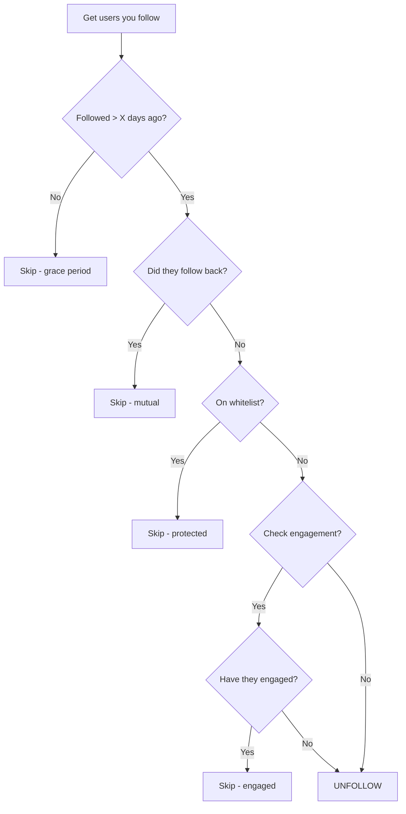

# Unfollow Users Guide

Clean up your following list strategically to improve your follower ratio and engagement.

## Why Unfollowing Matters

| Following:Follower Ratio | Perception |
|--------------------------|------------|
| 0.5 or lower | Authority/Influencer |
| 0.5 - 1.0 | Balanced/Professional |
| 1.0 - 2.0 | Normal user |
| 2.0+ | Looks like spam |

A healthy ratio improves:
- Profile credibility
- Follow-back rates on new follows
- Algorithm recommendations

## Unfollow Non-Followers

**The #1 most requested feature.** Unfollow everyone who doesn't follow you back:

=== "Python"

    ```python
    from xeepy import Xeepy

    async with Xeepy() as x:
        # Always preview first!
        preview = await x.unfollow.non_followers(
            max_unfollows=100,
            whitelist=["friend1", "mentor", "boss"],
            min_following_days=7,     # Grace period
            exclude_verified=True,     # Keep verified accounts
            min_followers=10000,       # Keep if they have 10k+ followers
            dry_run=True               # Preview mode
        )
        
        print(f"Would unfollow {preview.success_count} users:")
        for user in preview.unfollowed_users[:20]:
            print(f"  @{user}")
        
        # If satisfied, run for real
        if input("\nProceed? (y/n): ").lower() == 'y':
            result = await x.unfollow.non_followers(
                max_unfollows=100,
                whitelist=["friend1", "mentor", "boss"],
                min_following_days=7,
                exclude_verified=True,
                min_followers=10000,
                dry_run=False,
                on_unfollow=lambda u, s: print(f"{'✓' if s else '✗'} @{u}")
            )
            print(f"\n✅ Unfollowed {result.success_count} users")
    ```

=== "CLI"

    ```bash
    # Preview first
    xeepy unfollow non-followers --max 100 --grace-days 7 --exclude-verified --dry-run
    
    # Execute
    xeepy unfollow non-followers --max 100 --grace-days 7 --exclude-verified
    ```

### Statistics Callback

Get detailed stats before unfollowing:

```python
async def show_stats(stats):
    print(f"\n📊 Account Analysis")
    print(f"{'='*40}")
    print(f"Following:     {stats.total_following:,}")
    print(f"Followers:     {stats.total_followers:,}")
    print(f"Ratio:         {stats.ratio:.2f}")
    print(f"Non-followers: {stats.non_followers_count:,}")
    print(f"Mutual:        {stats.mutual_count:,}")
    print(f"{'='*40}\n")

result = await x.unfollow.non_followers(
    max_unfollows=100,
    on_stats=show_stats,
    dry_run=True
)
```

### Whitelist Management

Protect important accounts:

```python
from xeepy.storage import FollowTracker

tracker = FollowTracker("xeepy.db")

# Add to whitelist
tracker.add_to_whitelist("best_friend", reason="Personal friend")
tracker.add_to_whitelist("mentor_account", reason="Mentor")
tracker.add_to_whitelist("boss_twitter", reason="Work contact")
tracker.add_to_whitelist("favorite_creator", reason="Fan")

# Bulk add
friends = ["friend1", "friend2", "friend3"]
for friend in friends:
    tracker.add_to_whitelist(friend, reason="Friend")

# View whitelist
print("Protected accounts:")
for user in tracker.get_whitelist():
    print(f"  @{user}")

# Remove from whitelist
tracker.remove_from_whitelist("old_friend")
```

CLI whitelist management:

```bash
# Add
xeepy whitelist add friend1 friend2 --reason "Friends"

# List
xeepy whitelist list

# Remove  
xeepy whitelist remove old_friend

# Import from file
xeepy whitelist import whitelist.txt
```

## Smart Unfollow

Uses tracking data to make intelligent decisions:

```python
from xeepy import Xeepy

async with Xeepy() as x:
    # Check eligibility
    eligible = await x.unfollow.smart_eligible(days_threshold=7)
    print(f"{eligible} users haven't followed back in 7+ days")
    
    # Smart unfollow with engagement check
    result = await x.unfollow.smart(
        days_threshold=7,           # Followed 7+ days ago
        max_unfollows=50,
        check_engagement=True,      # Keep if they've engaged with you
        engagement_types=["like", "reply", "retweet"],
        whitelist=["friend1"],
        exclude_verified=True,
        dry_run=False
    )
    
    print(f"Unfollowed {result.success_count} dormant follows")
```

### How It Works



### Engagement Detection

```python
# Keep users who have engaged with you, even if they don't follow
result = await x.unfollow.smart(
    days_threshold=7,
    check_engagement=True,
    engagement_types=[
        "like",      # Liked your tweets
        "reply",     # Replied to you
        "retweet",   # Retweeted you
        "quote",     # Quote tweeted you
        "mention",   # Mentioned you
    ],
    engagement_lookback_days=30,  # Check last 30 days
    min_engagements=1,            # At least 1 interaction
)
```

## Unfollow by Criteria

Flexible unfollowing based on custom criteria:

```python
from xeepy import Xeepy
from xeepy.actions.unfollow.unfollow_by_criteria import UnfollowCriteria

# Define criteria
criteria = UnfollowCriteria(
    # Unfollow accounts with:
    max_followers=50,           # Less than 50 followers
    min_ratio=0.1,              # Following/follower ratio < 0.1
    inactive_days=90,           # No tweets in 90 days
    has_bio=False,              # No bio
    has_profile_pic=False,      # Default profile pic
    bio_contains=["spam", "bot", "follow back", "f4f"],
    from_source="keyword:crypto",  # Only from this source
)

async with Xeepy() as x:
    result = await x.unfollow.by_criteria(
        criteria=criteria,
        max_unfollows=50,
        must_be_non_follower=True,  # Only non-followers
        dry_run=True
    )
    
    print(f"Would unfollow {result.success_count} low-quality accounts")
```

### Common Criteria Patterns

```python
# Pattern 1: Spam accounts
spam_criteria = UnfollowCriteria(
    bio_contains=["follow back", "f4f", "follow 4 follow", "dm for promo"],
    max_followers=100,
)

# Pattern 2: Inactive accounts
inactive_criteria = UnfollowCriteria(
    inactive_days=180,  # 6 months
)

# Pattern 3: Low-quality accounts
low_quality = UnfollowCriteria(
    max_followers=50,
    has_bio=False,
    has_profile_pic=False,
)

# Pattern 4: Suspicious accounts
suspicious = UnfollowCriteria(
    min_following=5000,      # Following 5000+
    max_followers=100,       # But only 100 followers
    max_tweets=10,           # And barely any tweets
)

# Pattern 5: From specific campaign
campaign_cleanup = UnfollowCriteria(
    from_source="keyword:crypto",  # Only from crypto campaign
    must_be_non_follower=True,
)
```

## Mass Unfollow

Unfollow everyone (use with caution!):

```python
from xeepy import Xeepy

async with Xeepy() as x:
    def confirm(count):
        print(f"\n⚠️  WARNING: About to unfollow {count} users!")
        return input("Type 'CONFIRM' to proceed: ") == "CONFIRM"
    
    result = await x.unfollow.all(
        max_unfollows=500,        # Safety limit
        whitelist=["keeper1", "keeper2"],
        require_confirmation=True,
        on_confirm=confirm,
        batch_size=50,            # Process in batches
        batch_delay=60,           # Pause between batches
        on_progress=lambda p, t, m: print(f"[{p}/{t}] {m}")
    )
    
    print(f"\n✅ Unfollowed {result.success_count} users")
    print(f"⏭️  Skipped (whitelist): {result.skipped_count}")
```

!!! danger "Use Mass Unfollow Carefully"
    - Always use `dry_run=True` first
    - Set reasonable `max_unfollows` limits
    - Add important accounts to whitelist
    - Consider doing in batches over multiple days

## Single User Unfollow

Simple single-user unfollow:

```python
async with Xeepy() as x:
    result = await x.unfollow.user("someuser")
    
    if result.success:
        print(f"✓ Unfollowed @someuser")
```

Batch unfollow:

```python
users_to_unfollow = ["user1", "user2", "user3"]

result = await x.unfollow.users(
    usernames=users_to_unfollow,
    delay_range=(2, 5),
    on_unfollow=lambda u, s: print(f"{'✓' if s else '✗'} @{u}")
)
```

## Scheduling Unfollows

Spread unfollows over time:

```python
from xeepy import Xeepy
import asyncio
from datetime import datetime, timedelta

async def scheduled_cleanup():
    """Run unfollow in batches over multiple days"""
    
    async with Xeepy() as x:
        # Get total non-followers
        preview = await x.unfollow.non_followers(
            max_unfollows=1000,
            dry_run=True
        )
        
        total = preview.success_count
        per_day = 100
        days_needed = (total // per_day) + 1
        
        print(f"📊 Found {total} non-followers")
        print(f"📅 Will take {days_needed} days at {per_day}/day")
        
        for day in range(days_needed):
            print(f"\n🗓️  Day {day + 1}/{days_needed}")
            
            result = await x.unfollow.non_followers(
                max_unfollows=per_day,
                whitelist=["friend1"],
                min_following_days=7,
                exclude_verified=True,
            )
            
            print(f"  Unfollowed: {result.success_count}")
            
            if day < days_needed - 1:
                # Wait until tomorrow (or use task scheduler)
                print(f"  ⏳ Waiting until tomorrow...")
                await asyncio.sleep(24 * 60 * 60)

asyncio.run(scheduled_cleanup())
```

## Analytics & Reporting

Track your unfollow campaigns:

```python
from xeepy.storage import FollowTracker

tracker = FollowTracker("xeepy.db")

# Get unfollow stats
stats = tracker.get_stats()
print(f"Total unfollowed: {stats.total_unfollows}")
print(f"Unfollows this week: {stats.unfollows_this_week}")

# Get by reason
by_reason = tracker.get_unfollows_by_reason()
for reason, count in by_reason.items():
    print(f"  {reason}: {count}")

# Export history
tracker.export_unfollowed("unfollowed_users.csv")
```

### Daily Report

```python
async def daily_report():
    tracker = FollowTracker("xeepy.db")
    
    stats = tracker.get_daily_stats()
    
    report = f"""
📊 Daily Unfollow Report
{'='*40}

Today's Activity:
  - Unfollowed: {stats.today_unfollows}
  - New followers: {stats.today_new_followers}
  - Lost followers: {stats.today_lost_followers}

Running Totals:
  - Following: {stats.total_following}
  - Followers: {stats.total_followers}
  - Ratio: {stats.ratio:.2f}

Top Unfollow Reasons:
{chr(10).join(f'  - {r}: {c}' for r, c in stats.top_reasons.items())}

{'='*40}
"""
    print(report)
    
    # Or send via webhook
    # await send_discord_webhook(report)
```

## Best Practices

!!! success "Do's"
    - ✅ Always use `dry_run=True` first
    - ✅ Set up whitelist before any mass operations
    - ✅ Use 7+ day grace period for non-followers
    - ✅ Keep verified accounts and high-follower accounts
    - ✅ Spread large unfollows over multiple days
    - ✅ Track everything for analytics

!!! danger "Don'ts"
    - ❌ Unfollow more than 100-200/day
    - ❌ Follow/unfollow the same users repeatedly
    - ❌ Unfollow immediately after following
    - ❌ Skip the whitelist
    - ❌ Ignore rate limit warnings

## Troubleshooting

??? question "Rate limited while unfollowing"
    
    Twitter limits unfollows too. Solutions:
    
    1. Reduce `max_unfollows` to 50-100/day
    2. Increase delay: `delay_range=(5, 10)`
    3. Spread over multiple sessions
    4. Wait 24 hours before retrying

??? question "Wrong users unfollowed"
    
    Always use `dry_run=True` first. To recover:
    
    1. Export unfollowed list: `tracker.export_unfollowed("recovery.csv")`
    2. Re-follow important ones: `await x.follow.users(important_users)`
    3. Add to whitelist to prevent future issues

??? question "Whitelist not working"
    
    Check whitelist is loaded:
    
    ```python
    tracker = FollowTracker("xeepy.db")
    print(tracker.get_whitelist())  # Should show your protected users
    ```

## Next Steps

[:octicons-arrow-right-24: Engagement Automation](engagement.md) - Auto-like and comment

[:octicons-arrow-right-24: Growth Analytics](../analytics/growth.md) - Track your progress

[:octicons-arrow-right-24: Smart Targeting](../ai/targeting.md) - AI-powered targeting
